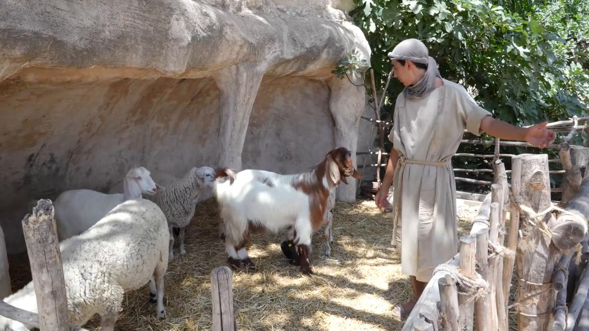
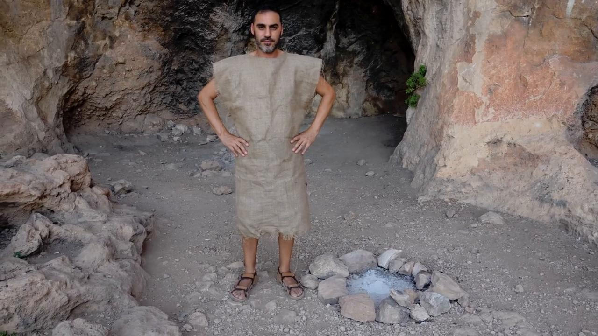

# Videos (Video Bible Dictionary)

**Video Bible Dictionary** © 2023 SRV Partners. Released under CC BY\-SA 4\.0 license. *Video Bible Dictionary* has been adapted in the following languages: Tok Pisin, عربي, Français, हिंदी, Bahasa Indonesia, Português, Русский, Español, Kiswahili, 简体中文 from *Video Bible Dictionary* © 2023 SRV Partners. Released under CC BY\-SA 4\.0 license by Mission Mutual

--------------------------------

## Adult and Kid Goat (id: a183)

### Video Content

 (67 seconds)

[link](https://s3.amazonaws.com/cbbt-er.public/media/videos/a183/720p.mp4)

* **Associated Passages:** Exodus 12:1-13; 1 Samuel 16:14-23; 1 Chronicles 27:25-31

## Adult Donkey (id: a1269)

### Video Content

 (89 seconds)

[link](https://s3.amazonaws.com/cbbt-er.public/media/videos/a1269/720p.mp4)

* **Associated Passages:** Genesis 22:1-19; Genesis 24:29-49; Genesis 32:1-21; Exodus 4:18-31; Exodus 9:1-7; Exodus 13:1-16; Exodus 20:8-17; Exodus 22:1-6; Exodus 22:7-15; Exodus 23:1-9; Numbers 31:25-54; Joshua 9:1-15; Joshua 15:13-19; Judges 1:9-17; Judges 6:1-10; Judges 10:1-5; Judges 12:8-15; Judges 15:9-20; 1 Samuel 8:10-22; 1 Samuel 9:1-14; 1 Samuel 12:1-17; 1 Samuel 15:1-9; 1 Samuel 27:1-28:2; 1 Kings 13:11-22; 1 Kings 13:23-34; 1 Chronicles 12:23-40; 1 Chronicles 27:25-31; 2 Chronicles 28:9-15; Ezra 2:64-70; Job 1:13-22; Luke 13:10-17; Luke 19:28-44; John 12:12-19

## Alabaster Jar (id: a41)

### Video Content

 (73 seconds)

[link](https://s3.amazonaws.com/cbbt-er.public/media/videos/a41/720p.mp4)

* **Associated Passages:** Matthew 26:1-16; Mark 14:1-11; Luke 7:36-8:3

## Ashes (id: a177)

### Video Content

 (74 seconds)

[link](https://s3.amazonaws.com/cbbt-er.public/media/videos/a177/720p.mp4)

* **Associated Passages:** Exodus 9:8-12; Job 2:7-13

## Axe (id: a182)

### Video Content

 (69 seconds)

[link](https://s3.amazonaws.com/cbbt-er.public/media/videos/a182/720p.mp4)

* **Associated Passages:** Judges 9:42-49; 1 Samuel 13:15-23; Matthew 3:1-17

