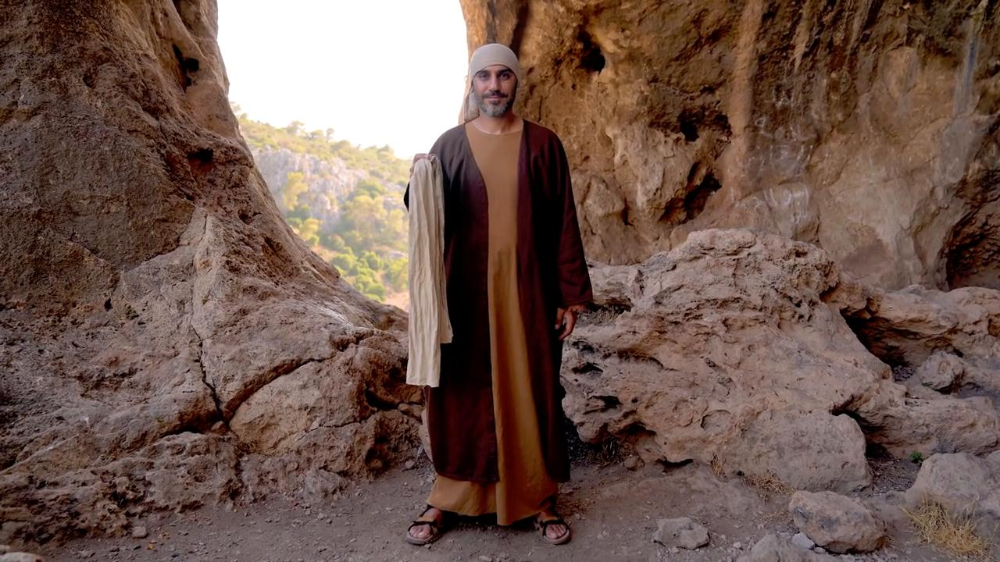
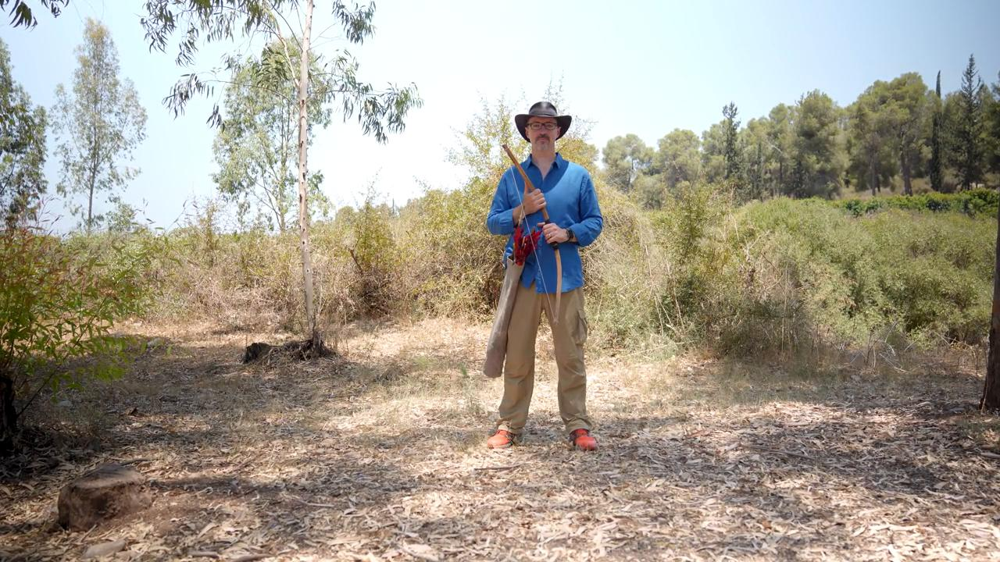

# Videos (Video Bible Dictionary)

**Video Bible Dictionary** © 2023 SRV Partners. Released under CC BY\-SA 4\.0 license. *Video Bible Dictionary* has been adapted in the following languages: Tok Pisin, عربي, Français, हिंदी, Bahasa Indonesia, Português, Русский, Español, Kiswahili, 简体中文 from *Video Bible Dictionary* © 2023 SRV Partners. Released under CC BY\-SA 4\.0 license by Mission Mutual

--------------------------------

## Basket as a Bushel (id: a30)

### Video Content

 (77 seconds)

[link](https://s3.amazonaws.com/cbbt-er.public/media/videos/a30/720p.mp4)

* **Associated Passages:** Matthew 5:13-16; Mark 4:21-25

## Basket for Provisions (id: a1253)

### Video Content

 (88 seconds)

[link](https://s3.amazonaws.com/cbbt-er.public/media/videos/a1253/720p.mp4)

* **Associated Passages:** Matthew 14:13-21; Matthew 15:29-39; Mark 6:30-44; Mark 8:11-21; John 6:1-15

## Belt (id: a135)

### Video Content

 (71 seconds)

[link](https://s3.amazonaws.com/cbbt-er.public/media/videos/a135/720p.mp4)

* **Associated Passages:** Acts 12:6-19; Acts 21:10-14

## Bitter Herbs (id: a39)

### Video Content

 (71 seconds)

[link](https://s3.amazonaws.com/cbbt-er.public/media/videos/a39/720p.mp4)

* **Associated Passages:** Exodus 12:1-13; Numbers 9:1-14; Matthew 26:17-25; Mark 14:12-26

## Bow and Arrows (id: a188)

### Video Content

 (107 seconds)

[link](https://s3.amazonaws.com/cbbt-er.public/media/videos/a188/720p.mp4)

* **Associated Passages:** Genesis 21:1-21; Genesis 26:34-27:17; Genesis 49:1-28; Numbers 23:27-24:13; Judges 4:1-10; Judges 16:4-14; 1 Samuel 2:1-11; 1 Samuel 17:55-18:5; 1 Samuel 20:18-34; 1 Samuel 20:35-42; 2 Samuel 1:17-27; 2 Samuel 11:14-27; 2 Samuel 22:5-20; 2 Samuel 22:30-46; 1 Chronicles 5:18-26; 1 Chronicles 8:29-40; 1 Chronicles 10:1-14; 1 Chronicles 12:1-7; 2 Chronicles 18:28-34; Ephesians 6:10-20

