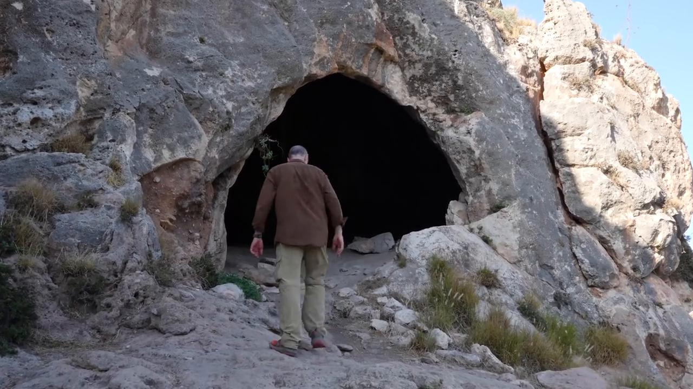
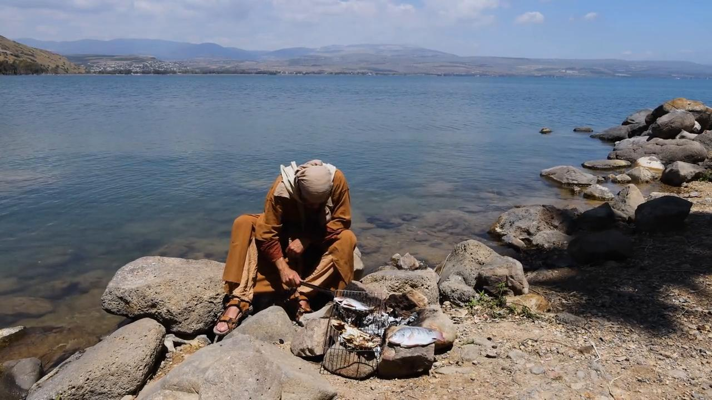

# Videos (Video Bible Dictionary)

**Video Bible Dictionary** © 2023 SRV Partners. Released under CC BY\-SA 4\.0 license. *Video Bible Dictionary* has been adapted in the following languages: Tok Pisin, عربي, Français, हिंदी, Bahasa Indonesia, Português, Русский, Español, Kiswahili, 简体中文 from *Video Bible Dictionary* © 2023 SRV Partners. Released under CC BY\-SA 4\.0 license by Mission Mutual

--------------------------------

## Camel (id: a9)

### Video Content

 (58 seconds)

[link](https://s3.amazonaws.com/cbbt-er.public/media/videos/a9/720p.mp4)

* **Associated Passages:** Genesis 24:1-14; Genesis 24:15-28; Genesis 24:29-49; Genesis 32:1-21; Leviticus 11:1-8; Judges 6:1-10; Judges 7:9-15; Judges 8:4-21; 1 Samuel 15:1-9; 1 Samuel 27:1-28:2; 1 Kings 9:26-10:13; 1 Chronicles 12:23-40; 1 Chronicles 27:25-31; 2 Chronicles 9:1-12; Ezra 2:64-70; Matthew 3:1-17; Matthew 19:13-30; Matthew 23:23-28; Mark 10:13-31; Luke 18:18-30

## Cave (id: a141)

### Video Content

 (94 seconds)

[link](https://s3.amazonaws.com/cbbt-er.public/media/videos/a141/720p.mp4)

* **Associated Passages:** Genesis 19:30-38; Joshua 10:16-28; Judges 6:1-10; Judges 15:1-8; Judges 15:9-20; 1 Samuel 24:1-7; 2 Samuel 17:15-29; 1 Kings 18:1-15; 1 Kings 19:9-21; Luke 19:45-20:8

## Chains (id: a26)

### Video Content

 (73 seconds)

[link](https://s3.amazonaws.com/cbbt-er.public/media/videos/a26/720p.mp4)

* **Associated Passages:** Mark 5:1-20; Luke 8:26-39

## Cliffs (id: a12)

### Video Content

 (49 seconds)

[link](https://s3.amazonaws.com/cbbt-er.public/media/videos/a12/720p.mp4)

* **Associated Passages:** Matthew 8:28-34; Mark 5:1-20

## Club (id: a25)

### Video Content

 (74 seconds)

[link](https://s3.amazonaws.com/cbbt-er.public/media/videos/a25/720p.mp4)

* **Associated Passages:** Exodus 21:18-27; Matthew 26:47-56; Mark 14:43-52

## Coins (id: a28)

### Video Content

 (65 seconds)

[link](https://s3.amazonaws.com/cbbt-er.public/media/videos/a28/720p.mp4)

* **Associated Passages:** Matthew 25:14-30; Mark 6:6-13

## Cooked Fish (id: a43)

### Video Content

 (81 seconds)

[link](https://s3.amazonaws.com/cbbt-er.public/media/videos/a43/720p.mp4)

* **Associated Passages:** Numbers 11:1-15; Matthew 15:29-39; Mark 6:30-44; Mark 8:1-10; Luke 9:1-17

## Copper Coins (id: a29)

### Video Content

 (69 seconds)

[link](https://s3.amazonaws.com/cbbt-er.public/media/videos/a29/720p.mp4)

* **Associated Passages:** Matthew 10:26-33; Mark 12:38-44; Luke 20:45-21:4

## Cornerstone with a Wall (id: a181)

### Video Content

 (77 seconds)

[link](https://s3.amazonaws.com/cbbt-er.public/media/videos/a181/720p.mp4)

* **Associated Passages:** Ephesians 2:19-22

