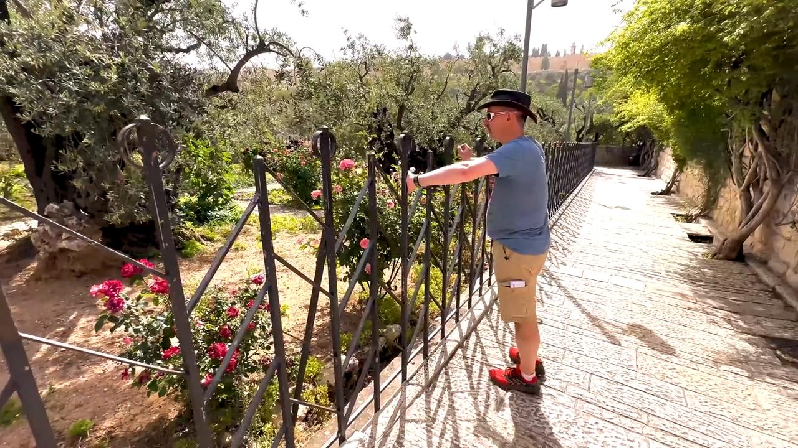

# Videos (Video Bible Dictionary)

**Video Bible Dictionary** © 2023 SRV Partners. Released under CC BY\-SA 4\.0 license. *Video Bible Dictionary* has been adapted in the following languages: Tok Pisin, عربي, Français, हिंदी, Bahasa Indonesia, Português, Русский, Español, Kiswahili, 简体中文 from *Video Bible Dictionary* © 2023 SRV Partners. Released under CC BY\-SA 4\.0 license by Mission Mutual

--------------------------------

## Garden of Gethsemane (id: a37)

### Video Content

 (108 seconds)

[link](https://s3.amazonaws.com/cbbt-er.public/media/videos/a37/720p.mp4)

* **Associated Passages:** Matthew 26:36-46; Mark 14:32-42

## Garden Tomb (id: a35)

### Video Content

 (84 seconds)

[link](https://s3.amazonaws.com/cbbt-er.public/media/videos/a35/720p.mp4)

* **Associated Passages:** Judges 8:22-35; Mark 15:40-47; Mark 16:1-8

## Goat Skin (id: a1352)

### Video Content

 (81 seconds)

[link](https://s3.amazonaws.com/cbbt-er.public/media/videos/a1352/720p.mp4)

* **Associated Passages:** Genesis 26:34-27:17; 1 Samuel 19:11-24

