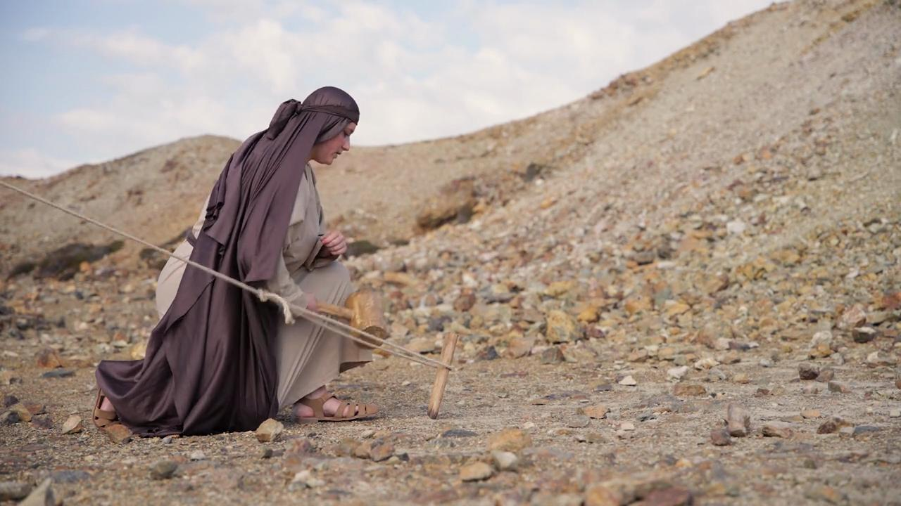
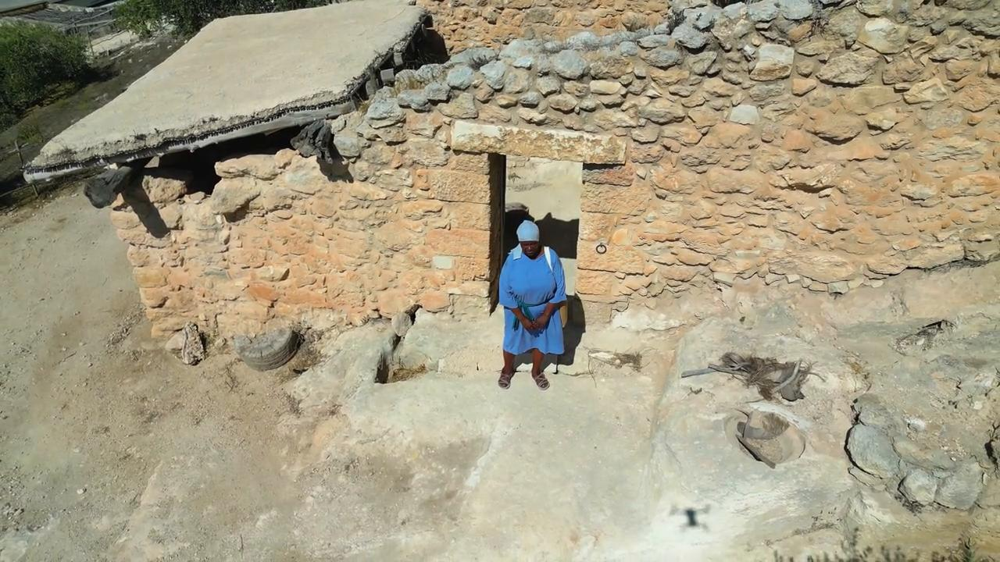

# Familiarization, Internalization, Articulation (FIA) Videos

**Video Bible Dictionary** © 2025 Word Collective. Released under CC BY\-SA 4\.0 license. *Video Bible Dictionary* has been adapted in the following languages: Tok Pisin, عربي, Français, हिंदी, Bahasa Indonesia, Português, Русский, Español, Kiswahili, 简体中文 from *Video Bible Dictionary* © 2025 Word Collective. Released under CC BY\-SA 4\.0 license by Mission Mutual

--------------------------------

## Hail Falling (id: a1444)

### Video Content

 (12 seconds)

[link](https://s3.amazonaws.com/cbbt-er.public/media/videos/a1444/720p.mp4)

* **Associated Passages:** Exodus 9:13-21; Exodus 9:22-35

## Hammer and Tent Pegs (id: a2218)

### Video Content

 (0 seconds)

[link](https://s3.amazonaws.com/cbbt-er.public/media/videos/a2218/720p.mp4)

* **Associated Passages:** Judges 4:11-24; Judges 5:24-31

## Hammer and Tent Pegs (id: a2219)

### Video Content

 (0 seconds)

[link](https://s3.amazonaws.com/cbbt-er.public/media/videos/a2219/720p.mp4)

* **Associated Passages:** Judges 4:11-24; Judges 5:24-31

## Hammer and Tent Pegs (id: a2220)

### Video Content

 (0 seconds)

[link](https://s3.amazonaws.com/cbbt-er.public/media/videos/a2220/720p.mp4)

* **Associated Passages:** Judges 4:11-24; Judges 5:24-31

## House in the Time of Jesus (id: a145)

### Video Content

 (87 seconds)

[link](https://s3.amazonaws.com/cbbt-er.public/media/videos/a145/720p.mp4)

* **Associated Passages:** Leviticus 27:9-15; 1 Samuel 9:15-27; Matthew 10:26-33; Matthew 24:15-28; Matthew 24:37-44; Mark 2:1-12; Mark 13:9-23; Luke 5:17-26; Luke 12:1-12; Luke 22:47-62; Acts 9:36-43; Acts 10:9-23

