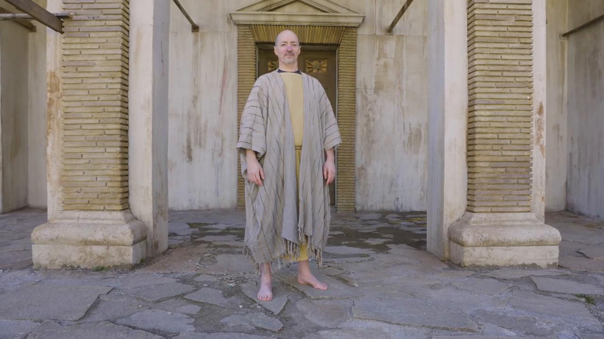

# Videos (Video Bible Dictionary)

**Video Bible Dictionary** © 2023 SRV Partners. Released under CC BY\-SA 4\.0 license. *Video Bible Dictionary* has been adapted in the following languages: Tok Pisin, عربي, Français, हिंदी, Bahasa Indonesia, Português, Русский, Español, Kiswahili, 简体中文 from *Video Bible Dictionary* © 2023 SRV Partners. Released under CC BY\-SA 4\.0 license by Mission Mutual

--------------------------------

## Jordan River (id: a13)

### Video Content

 (79 seconds)

[link](https://s3.amazonaws.com/cbbt-er.public/media/videos/a13/720p.mp4)

* **Associated Passages:** Deuteronomy 6:1-9; Deuteronomy 9:1-6; Joshua 12:1-6; Judges 8:1-3; 1 Samuel 13:1-14; Mark 1:1-13; Luke 3:1-14

## Joseph's Coat (id: a1354)

### Video Content

 (88 seconds)

[link](https://s3.amazonaws.com/cbbt-er.public/media/videos/a1354/720p.mp4)

* **Associated Passages:** Genesis 37:1-11; Genesis 37:12-36

