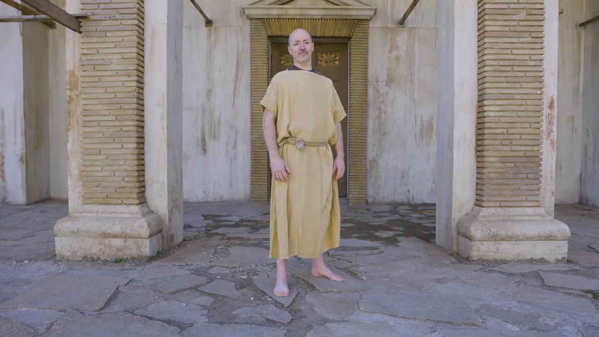

# Videos (Video Bible Dictionary)

**Video Bible Dictionary** © 2023 SRV Partners. Released under CC BY\-SA 4\.0 license. *Video Bible Dictionary* has been adapted in the following languages: Tok Pisin, عربي, Français, हिंदी, Bahasa Indonesia, Português, Русский, Español, Kiswahili, 简体中文 from *Video Bible Dictionary* © 2023 SRV Partners. Released under CC BY\-SA 4\.0 license by Mission Mutual

--------------------------------

## Man Who Is Girded Up (id: a1355)

### Video Content

 (67 seconds)

[link](https://s3.amazonaws.com/cbbt-er.public/media/videos/a1355/720p.mp4)

* **Associated Passages:** 1 Kings 18:41-46; Luke 12:35-48; Acts 12:6-19

## Manger (id: a33)

### Video Content

 (70 seconds)

[link](https://s3.amazonaws.com/cbbt-er.public/media/videos/a33/720p.mp4)

* **Associated Passages:** Luke 2:1-21

## Millstone (id: a32)

### Video Content

 (88 seconds)

[link](https://s3.amazonaws.com/cbbt-er.public/media/videos/a32/720p.mp4)

* **Associated Passages:** Judges 9:50-57; Judges 16:15-22; 2 Samuel 11:14-27; Matthew 24:37-44; Mark 9:30-50; Luke 17:1-10

## Mount of Olives (id: a40)

### Video Content

 (90 seconds)

[link](https://s3.amazonaws.com/cbbt-er.public/media/videos/a40/720p.mp4)

* **Associated Passages:** 2 Samuel 16:1-4; Matthew 21:1-11; Matthew 24:3-14; Matthew 24:29-36; Matthew 24:37-44; Matthew 24:45-51; Matthew 26:26-35; Mark 11:1-11; Mark 13:1-8; Mark 13:24-31; Mark 13:32-37; Mark 14:12-26; Luke 19:28-44; Luke 22:39-46; John 8:1-11; Acts 1:12-14

## Mount Precipice (id: a143)

### Video Content

 (101 seconds)

[link](https://s3.amazonaws.com/cbbt-er.public/media/videos/a143/720p.mp4)

* **Associated Passages:** Luke 4:14-30

