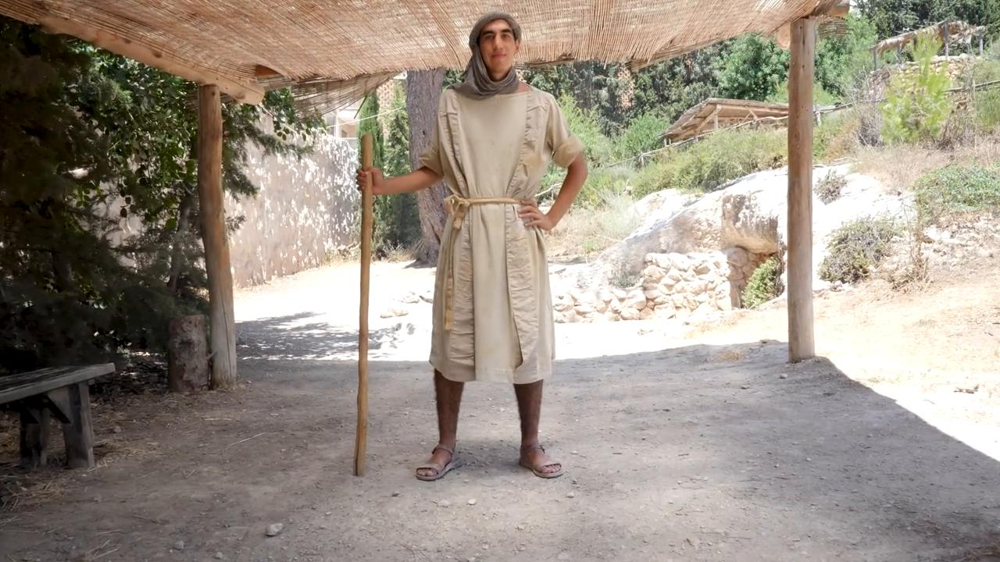
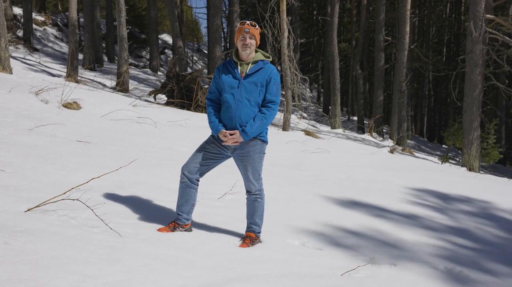
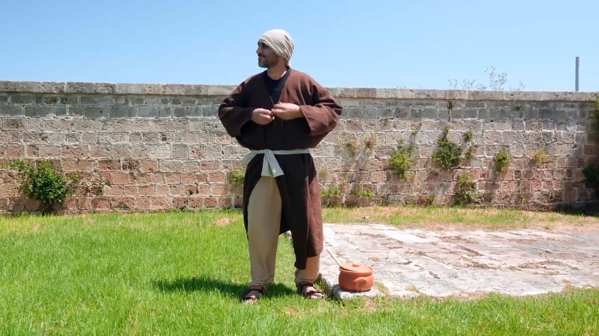

# Videos (Video Bible Dictionary)

**Video Bible Dictionary** © 2023 SRV Partners. Released under CC BY\-SA 4\.0 license. *Video Bible Dictionary* has been adapted in the following languages: Tok Pisin, عربي, Français, हिंदी, Bahasa Indonesia, Português, Русский, Español, Kiswahili, 简体中文 from *Video Bible Dictionary* © 2023 SRV Partners. Released under CC BY\-SA 4\.0 license by Mission Mutual

--------------------------------

## Sackcloth (id: a139)

### Video Content

 (70 seconds)

[link](https://s3.amazonaws.com/cbbt-er.public/media/videos/a139/720p.mp4)

* **Associated Passages:** Genesis 37:12-36; 2 Samuel 3:31-39; 2 Samuel 21:1-14; 1 Kings 20:23-34; 1 Kings 21:17-29; 1 Chronicles 21:7-17; Matthew 11:20-24; Luke 10:1-16

## Sacrificial Animals (id: a169)

### Video Content

 (91 seconds)

[link](https://s3.amazonaws.com/cbbt-er.public/media/videos/a169/720p.mp4)

* **Associated Passages:** Numbers 7:84-89; Matthew 21:12-22

## Sandals (id: a184)

### Video Content

 (56 seconds)

[link](https://s3.amazonaws.com/cbbt-er.public/media/videos/a184/720p.mp4)

* **Associated Passages:** Genesis 14:17-24; Exodus 3:1-10; Deuteronomy 25:1-10; Joshua 5:10-15; 1 Kings 2:1-12; 2 Chronicles 28:9-15; Matthew 3:1-17; Mark 1:1-13; Mark 6:6-13; Luke 3:15-22; Luke 9:1-17; Luke 15:11-32; John 1:19-28; John 13:1-11; Acts 7:20-34; Acts 12:6-19

## Sea of Galilee (id: a11)

### Video Content

 (114 seconds)

[link](https://s3.amazonaws.com/cbbt-er.public/media/videos/a11/720p.mp4)

* **Associated Passages:** Matthew 4:12-25; Matthew 8:23-27; Matthew 8:28-34; Matthew 14:13-21; Matthew 14:22-36; Mark 1:14-20; Mark 1:21-28; Mark 4:1-20; Mark 4:21-25; Mark 4:26-34; Mark 4:35-41; Mark 5:21-34; Luke 8:22-25; Luke 8:26-39; John 6:16-21; John 6:28-40

## Sickle (id: a185)

### Video Content

 (68 seconds)

[link](https://s3.amazonaws.com/cbbt-er.public/media/videos/a185/720p.mp4)

* **Associated Passages:** Deuteronomy 16:9-17; 1 Samuel 6:1-18; Mark 4:26-34

## Sleeping Mat (id: a31)

### Video Content

 (59 seconds)

[link](https://s3.amazonaws.com/cbbt-er.public/media/videos/a31/720p.mp4)

* **Associated Passages:** Matthew 9:1-8; Mark 2:1-12; Mark 6:45-56; Luke 5:17-26; John 5:1-15; Acts 5:12-16; Acts 9:32-35

## Snake (id: a168)

### Video Content

 (74 seconds)

[link](https://s3.amazonaws.com/cbbt-er.public/media/videos/a168/720p.mp4)

* **Associated Passages:** Genesis 3:1-24; Exodus 4:1-17; Numbers 21:1-9; 1 Kings 4:29-34; Matthew 7:1-12; Matthew 10:16-25; Matthew 12:33-37; Mark 16:9-20; Luke 3:1-14; Luke 10:17-24; Luke 11:1-13; John 3:9-21; 1 Corinthians 10:1-13

## Snow (id: a1262)

### Video Content

 (79 seconds)

[link](https://s3.amazonaws.com/cbbt-er.public/media/videos/a1262/720p.mp4)

* **Associated Passages:** Numbers 12:1-16; 2 Samuel 23:18-23; 1 Chronicles 11:20-25; Matthew 28:1-15

## Sponge with Wine on a Stick (id: a1381)

### Video Content

 (73 seconds)

[link](https://s3.amazonaws.com/cbbt-er.public/media/videos/a1381/720p.mp4)

* **Associated Passages:** Mark 15:33-39; John 19:17-30

## Staff (id: a166)

### Video Content

 (53 seconds)

[link](https://s3.amazonaws.com/cbbt-er.public/media/videos/a166/720p.mp4)

* **Associated Passages:** Exodus 4:1-17; Exodus 4:18-31; Exodus 8:16-19; Exodus 9:22-35; Exodus 10:1-20; Exodus 17:1-7; Exodus 21:18-27; Numbers 17:1-13; Numbers 22:22-40; 1 Samuel 17:31-40; 1 Samuel 17:41-54; Mark 6:6-13

## Stew (id: a113)

### Video Content

 (72 seconds)

[link](https://s3.amazonaws.com/cbbt-er.public/media/videos/a113/720p.mp4)

* **Associated Passages:** Genesis 25:19-34

## Stick (id: a170)

### Video Content

 (70 seconds)

[link](https://s3.amazonaws.com/cbbt-er.public/media/videos/a170/720p.mp4)

* **Associated Passages:** Exodus 21:18-27; Matthew 27:27-31; Mark 15:16-32

## Stone Wall Around a Vineyard (id: a34)

### Video Content

 (71 seconds)

[link](https://s3.amazonaws.com/cbbt-er.public/media/videos/a34/720p.mp4)

* **Associated Passages:** Matthew 21:33-46; Mark 12:1-12

## Synagogue (id: a186)

### Video Content

 (88 seconds)

[link](https://s3.amazonaws.com/cbbt-er.public/media/videos/a186/720p.mp4)

* **Associated Passages:** Deuteronomy 17:14-20; Matthew 4:12-25; Matthew 6:1-8; Matthew 10:16-25; Matthew 12:1-14; Mark 1:21-28; Mark 2:23-3:6; Mark 5:21-34; Mark 6:1-6; Luke 4:14-30; Luke 4:31-44; Luke 6:1-11; Luke 7:1-10; Luke 12:1-12; Luke 13:10-17; Luke 21:12-19; John 6:52-59; John 9:24-34; Acts 13:13-22; Acts 14:1-7; Acts 17:1-9; Acts 19:8-10

