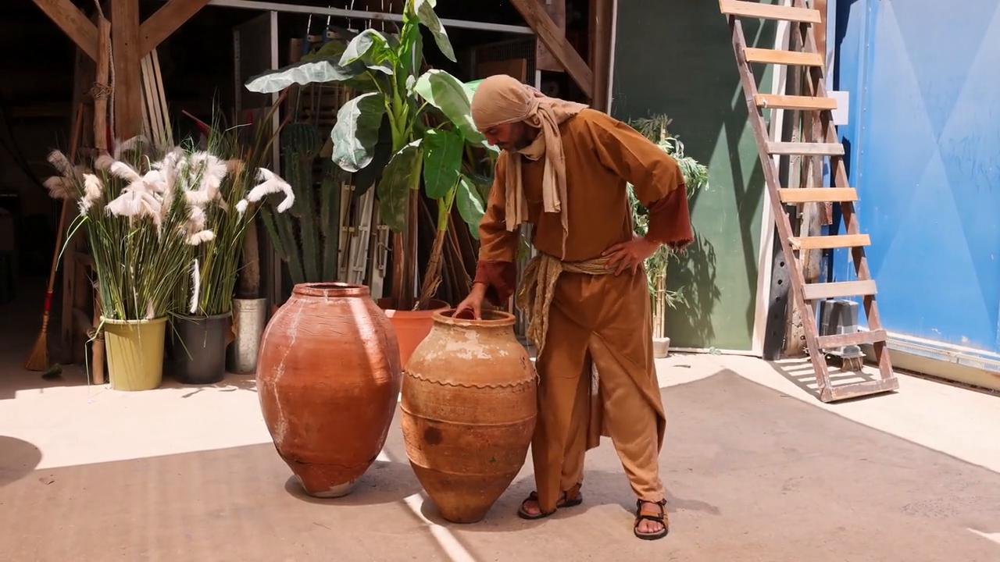
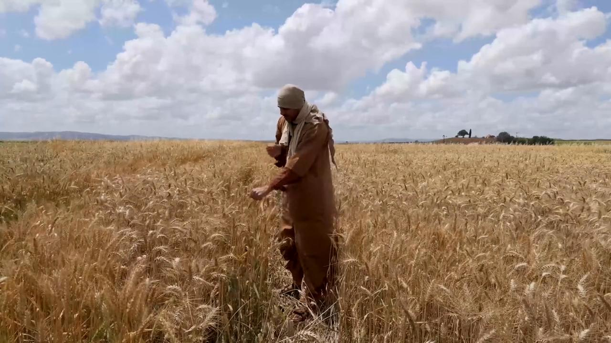
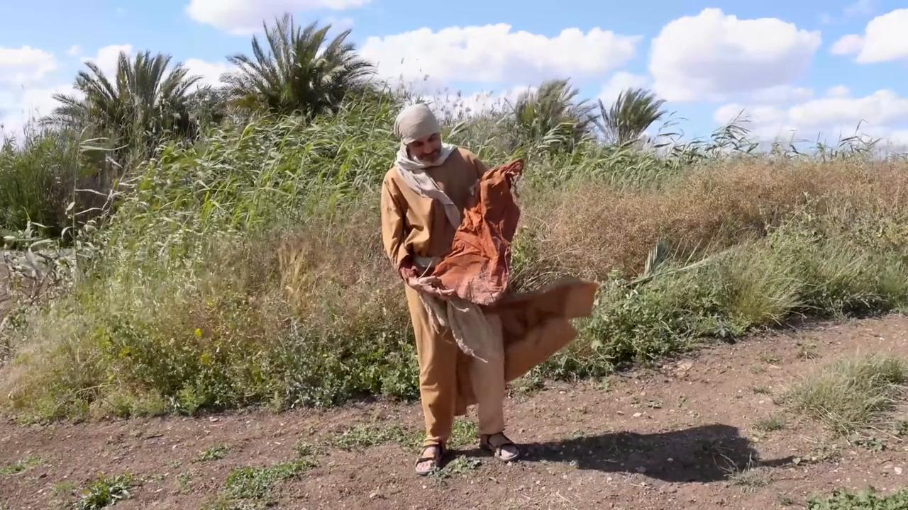

# Videos (Video Bible Dictionary)

**Video Bible Dictionary** © 2023 SRV Partners. Released under CC BY\-SA 4\.0 license. *Video Bible Dictionary* has been adapted in the following languages: Tok Pisin, عربي, Français, हिंदी, Bahasa Indonesia, Português, Русский, Español, Kiswahili, 简体中文 from *Video Bible Dictionary* © 2023 SRV Partners. Released under CC BY\-SA 4\.0 license by Mission Mutual

--------------------------------

## Watchtower for a Vineyard (id: a36)

### Video Content

 (97 seconds)

[link](https://s3.amazonaws.com/cbbt-er.public/media/videos/a36/720p.mp4)

* **Associated Passages:** Genesis 35:21-29; 1 Chronicles 27:25-31; Matthew 21:33-46; Mark 12:1-12; Luke 14:25-35

## Water Jar (id: a20)

### Video Content

 (63 seconds)

[link](https://s3.amazonaws.com/cbbt-er.public/media/videos/a20/720p.mp4)

* **Associated Passages:** Genesis 24:1-14; Genesis 24:15-28; 1 Kings 17:8-16; 1 Kings 18:30-40; 1 Kings 19:1-8; Mark 14:12-26; John 2:1-12; John 4:27-42; 2 Corinthians 4:7-12

## Wheat Ready For Harvest (id: a1)

### Video Content

 (79 seconds)

[link](https://s3.amazonaws.com/cbbt-er.public/media/videos/a1/720p.mp4)

* **Associated Passages:** Genesis 41:1-36; Exodus 22:1-6; Leviticus 6:19-23; Numbers 15:1-16; Numbers 20:1-13; Judges 6:11-27; Judges 15:1-8; 1 Samuel 12:1-17; 2 Samuel 4:1-12; 2 Samuel 17:15-29; 1 Kings 5:1-12; 1 Chronicles 21:18-22:1; 2 Chronicles 27:1-9; Matthew 3:1-17; Matthew 13:18-23; Mark 1:40-45; Mark 4:1-20; Luke 3:15-22; Luke 8:4-15; John 12:20-36; 1 Corinthians 15:35-41

## Wheat with Heads of Grain (id: a2)

### Video Content

 (131 seconds)

[link](https://s3.amazonaws.com/cbbt-er.public/media/videos/a2/720p.mp4)

* **Associated Passages:** Leviticus 6:19-23; 1 Kings 5:1-12; Matthew 12:1-14; Mark 2:23-3:6; Luke 6:1-11; 1 Corinthians 15:35-41

## White Robe (id: a131)

### Video Content

 (76 seconds)

[link](https://s3.amazonaws.com/cbbt-er.public/media/videos/a131/720p.mp4)

* **Associated Passages:** Mark 16:1-8

## Wilderness or Desert (id: a10)

### Video Content

 (55 seconds)

[link](https://s3.amazonaws.com/cbbt-er.public/media/videos/a10/720p.mp4)

* **Associated Passages:** Exodus 3:1-10; Exodus 3:11-22; Exodus 17:1-7; Leviticus 16:15-22; Numbers 14:26-38; Numbers 21:10-20; Numbers 34:1-15; Joshua 15:13-19; Joshua 15:48-63; Judges 1:9-17; 1 Samuel 25:1-13; 1 Samuel 26:1-12; 2 Samuel 2:18-3:1; 2 Samuel 15:13-23; Matthew 3:1-17; Matthew 4:1-11; Matthew 24:15-28; Mark 1:1-13; Mark 8:1-10; Luke 1:57-80; Luke 3:1-14; Luke 4:1-13; Luke 5:12-16; Luke 7:18-35; John 1:19-28; Acts 7:35-43; Acts 7:44-53; 1 Corinthians 10:1-13

## Wineskins (id: a6)

### Video Content

 (59 seconds)

[link](https://s3.amazonaws.com/cbbt-er.public/media/videos/a6/720p.mp4)

* **Associated Passages:** Joshua 9:1-15; 1 Samuel 1:19-28; 1 Samuel 16:14-23; 1 Samuel 25:14-22; 2 Samuel 16:1-4; Ezra 7:11-28; Matthew 9:14-17; Mark 2:18-22; Luke 5:27-39

## Winnowing Fork (id: a24)

### Video Content

 (75 seconds)

[link](https://s3.amazonaws.com/cbbt-er.public/media/videos/a24/720p.mp4)

* **Associated Passages:** 1 Chronicles 13:1-14; Psalms 1:1-6; Matthew 3:1-17; Luke 3:15-22

## Writing Tablet (id: a118)

### Video Content

 (72 seconds)

[link](https://s3.amazonaws.com/cbbt-er.public/media/videos/a118/720p.mp4)

* **Associated Passages:** Luke 1:57-80

