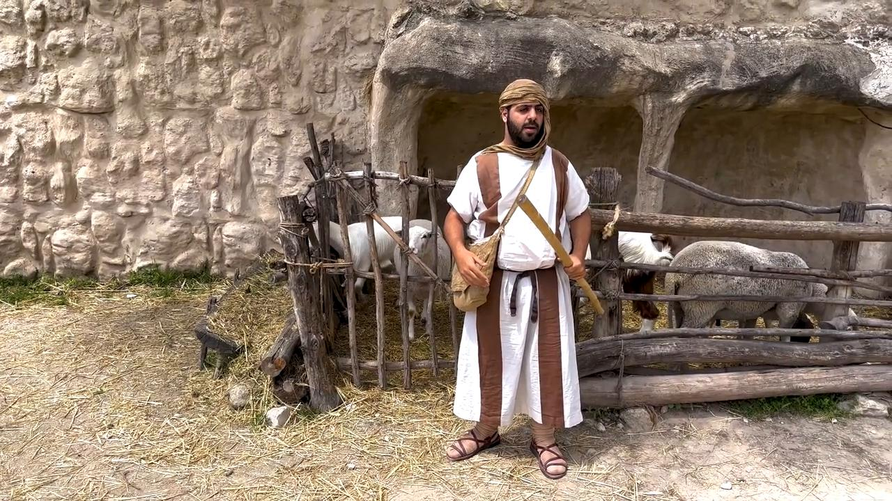

# Videos (Video Bible Dictionary)

**Video Bible Dictionary** © 2023 SRV Partners. Released under CC BY\-SA 4\.0 license. *Video Bible Dictionary* has been adapted in the following languages: Tok Pisin, عربي, Français, हिंदी, Bahasa Indonesia, Português, Русский, Español, Kiswahili, 简体中文 from *Video Bible Dictionary* © 2023 SRV Partners. Released under CC BY\-SA 4\.0 license by Mission Mutual

--------------------------------

## bâton (id: a166)

### Video Content

 (53 seconds)

[link](https://s3.amazonaws.com/cbbt-er.public/media/videos/a166/720p.mp4)

* **Associated Passages:** Exode 4.1-17; Exode 4.18-31; Exode 8.16-19; Exode 9.22-35; Exode 10.1-20; Exode 17.1-7; Exode 21.18-27; Nombres 17.1-13; Nombres 22.22-40; 1 Samuel 17.31-40; 1 Samuel 17.41-54; Marc 6.6-13

## Blé avec des têtes de grain (id: a2)

### Video Content

 (131 seconds)

[link](https://s3.amazonaws.com/cbbt-er.public/media/videos/a2/720p.mp4)

* **Associated Passages:** Lévitique 6.19-23; 1 Rois 5.1-12; Matthieu 12.1-14; Marc 2.23-3.6; Luc 6.1-11; 1 Corinthiens 15.35-41

## Blé Prêt Pour La Récolte (id: a1)

### Video Content

 (79 seconds)

[link](https://s3.amazonaws.com/cbbt-er.public/media/videos/a1/720p.mp4)

* **Associated Passages:** Genèse 41.1-36; Exode 22.1-6; Lévitique 6.19-23; Nombres 15.1-16; Nombres 20.1-13; Juges 6.11-27; Juges 15.1-8; 1 Samuel 12.1-17; 2 Samuel 4.1-12; 2 Samuel 17.15-29; 1 Rois 5.1-12; 1 Chroniques 21.18-22.1; 2 Chroniques 27.1-9; Matthieu 3.1-17; Matthieu 13.18-23; Marc 1.40-45; Marc 4.1-20; Luc 3.15-22; Luc 8.4-15; Jean 12.20-36; 1 Corinthiens 15.35-41

## Branches d'olivier et de palmier (id: a5)

### Video Content

 (68 seconds)

[link](https://s3.amazonaws.com/cbbt-er.public/media/videos/a5/720p.mp4)

* **Associated Passages:** Marc 11.1-11; Jean 12.12-19

