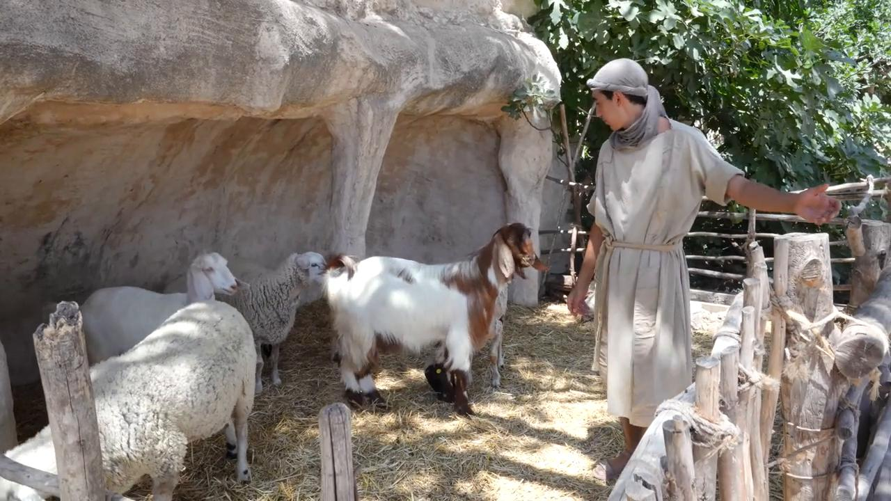

# Familiarization, Internalization, Articulation (FIA) Videos

**Video Bible Dictionary** © 2025 Word Collective. Released under CC BY\-SA 4\.0 license. *Video Bible Dictionary* has been adapted in the following languages: Tok Pisin, عربي, Français, हिंदी, Bahasa Indonesia, Português, Русский, Español, Kiswahili, 简体中文 from *Video Bible Dictionary* © 2025 Word Collective. Released under CC BY\-SA 4\.0 license by Mission Mutual

--------------------------------

## Animaux sacrificiels (id: a169)

### Video Content

 (91 seconds)

[link](https://s3.amazonaws.com/cbbt-er.public/media/videos/a169/720p.mp4)

* **Associated Passages:** Nombres 7.84-89; Matthieu 21.12-22

## Animaux sacrificiels (id: a183)

### Video Content

 (67 seconds)

[link](https://s3.amazonaws.com/cbbt-er.public/media/videos/a183/720p.mp4)

* **Associated Passages:** Nombres 7.84-89; Matthieu 21.12-22

