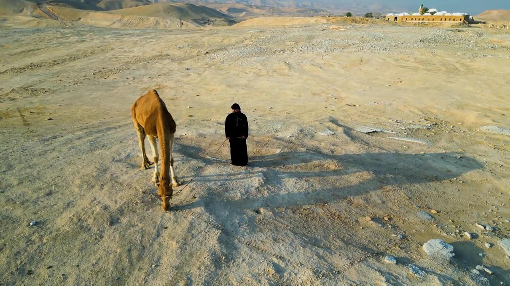
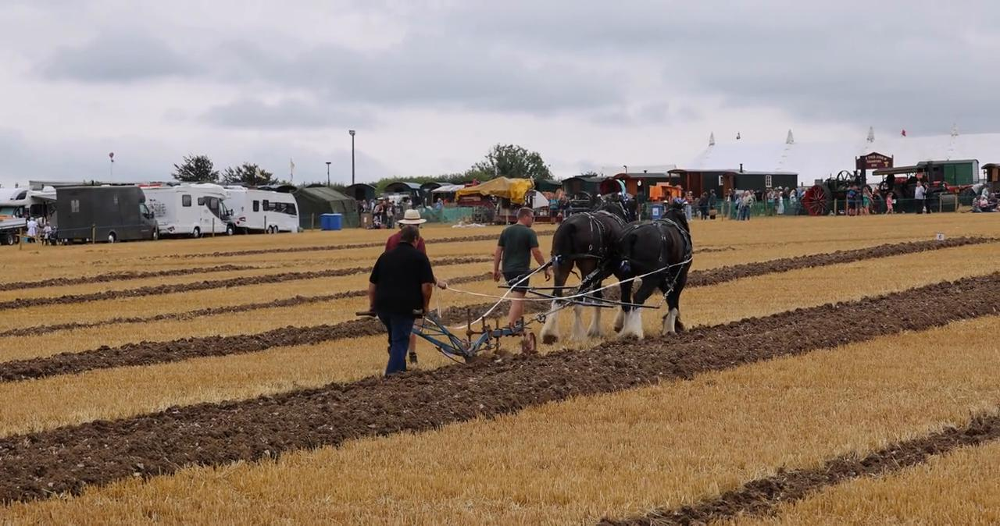

# Videos (Video Bible Dictionary)

**Video Bible Dictionary** © 2023 SRV Partners. Released under CC BY\-SA 4\.0 license. *Video Bible Dictionary* has been adapted in the following languages: Tok Pisin, عربي, Français, हिंदी, Bahasa Indonesia, Português, Русский, Español, Kiswahili, 简体中文 from *Video Bible Dictionary* © 2023 SRV Partners. Released under CC BY\-SA 4\.0 license by Mission Mutual

--------------------------------

## Chameau (id: a9)

### Video Content

 (58 seconds)

[link](https://s3.amazonaws.com/cbbt-er.public/media/videos/a9/720p.mp4)

* **Associated Passages:** Genèse 24.1-14; Genèse 24.15-28; Genèse 24.29-49; Genèse 32.1-21; Lévitique 11.1-8; Juges 6.1-10; Juges 7.9-15; Juges 8.4-21; 1 Samuel 15.1-9; 1 Samuel 27.1-28.2; 1 Rois 9.26-10.13; 1 Chroniques 12.23-40; 1 Chroniques 27.25-31; 2 Chroniques 9.1-12; Esdras 2.64-70; Matthieu 3.1-17; Matthieu 19.13-30; Matthieu 23.23-28; Marc 10.13-31; Luc 18.18-30

## chandelier (id: a21)

### Video Content

 (84 seconds)

[link](https://s3.amazonaws.com/cbbt-er.public/media/videos/a21/720p.mp4)

* **Associated Passages:** Matthieu 5.13-16; Marc 4.21-25; Luc 8.16-18

## Club (id: a25)

### Video Content

 (74 seconds)

[link](https://s3.amazonaws.com/cbbt-er.public/media/videos/a25/720p.mp4)

* **Associated Passages:** Exode 21.18-27; Matthieu 26.47-56; Marc 14.43-52

## Coq (id: a1388)

### Video Content

 (5 seconds)

[link](https://s3.amazonaws.com/cbbt-er.public/media/videos/a1388/720p.mp4)

* **Associated Passages:** Matthieu 26.26-35; Matthieu 26.69-75; Marc 14.27-31; Marc 14.66-72; Luc 22.24-38; Luc 22.47-62; Jean 13.31-38; Jean 18.15-27

## Cultiver un champ (id: a1404)

### Video Content

 (0 seconds)

[link](https://s3.amazonaws.com/cbbt-er.public/media/videos/a1404/720p.mp4)

* **Associated Passages:** Genèse 45.1-28; Juges 14.10-20; 1 Samuel 13.15-23; Matthieu 13.1-9; Marc 4.1-20; Luc 9.46-62

