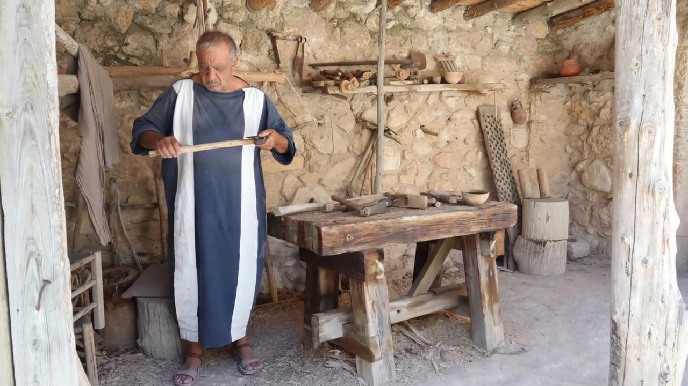
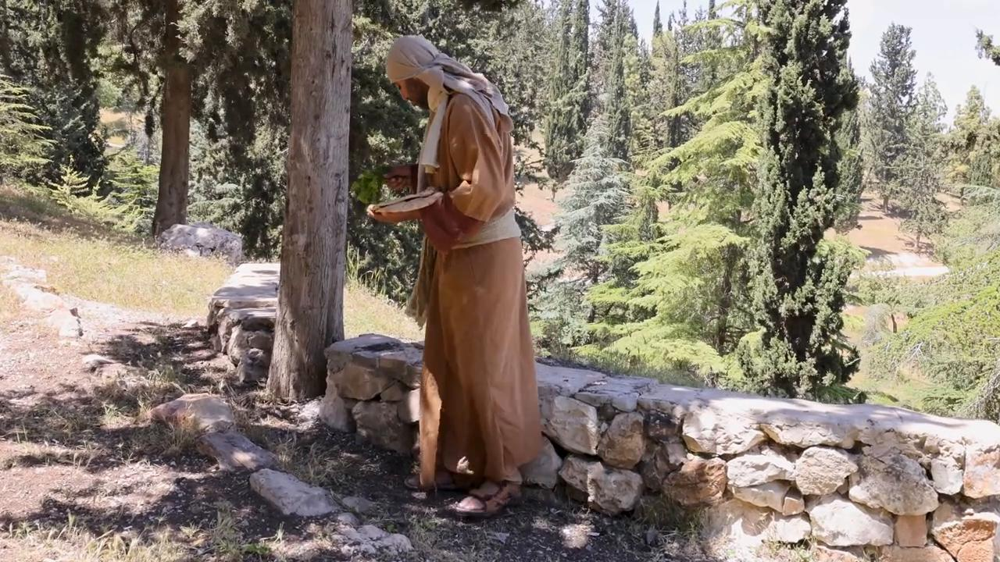

# Videos (Video Bible Dictionary)

**Video Bible Dictionary** © 2023 SRV Partners. Released under CC BY\-SA 4\.0 license. *Video Bible Dictionary* has been adapted in the following languages: Tok Pisin, عربي, Français, हिंदी, Bahasa Indonesia, Português, Русский, Español, Kiswahili, 简体中文 from *Video Bible Dictionary* © 2023 SRV Partners. Released under CC BY\-SA 4\.0 license by Mission Mutual

--------------------------------

## Hache (id: a182)

### Video Content

 (69 seconds)

[link](https://s3.amazonaws.com/cbbt-er.public/media/videos/a182/720p.mp4)

* **Associated Passages:** Juges 9.42-49; 1 Samuel 13.15-23; Matthieu 3.1-17

## Herbes amères (id: a39)

### Video Content

 (71 seconds)

[link](https://s3.amazonaws.com/cbbt-er.public/media/videos/a39/720p.mp4)

* **Associated Passages:** Exode 12.1-13; Nombres 9.1-14; 2 Chroniques 35.1-19; Matthieu 26.17-25; Marc 14.12-26

