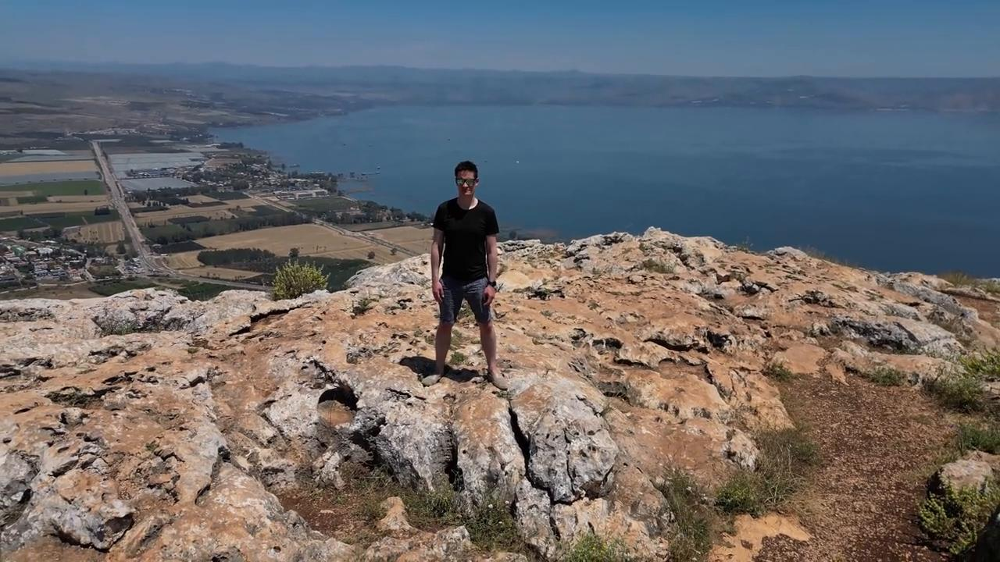

# Videos (Video Bible Dictionary)

**Video Bible Dictionary** © 2023 SRV Partners. Released under CC BY\-SA 4\.0 license. *Video Bible Dictionary* has been adapted in the following languages: Tok Pisin, عربي, Français, हिंदी, Bahasa Indonesia, Português, Русский, Español, Kiswahili, 简体中文 from *Video Bible Dictionary* © 2023 SRV Partners. Released under CC BY\-SA 4\.0 license by Mission Mutual

--------------------------------

## Maison à l'époque de Jésus (id: a145)

### Video Content

 (87 seconds)

[link](https://s3.amazonaws.com/cbbt-er.public/media/videos/a145/720p.mp4)

* **Associated Passages:** 1 Samuel 9.15-27; Matthieu 10.26-33; Matthieu 24.15-28; Matthieu 24.37-44; Marc 2.1-12; Marc 13.9-23; Luc 5.17-26; Luc 12.1-12; Actes 9.36-43; Actes 10.9-23

## Manteau (id: a133)

### Video Content

 (72 seconds)

[link](https://s3.amazonaws.com/cbbt-er.public/media/videos/a133/720p.mp4)

* **Associated Passages:** Exode 3.11-22; Exode 4.1-17; Exode 22.7-15; Exode 22.25-31; Deutéronome 24.10-16; Juges 14.10-20; 1 Rois 11.26-43; 1 Rois 18.41-46; Matthieu 5.33-42; Matthieu 24.15-28; Marc 5.21-34; Marc 10.46-52; Marc 11.1-11; Marc 13.9-23; Luc 6.27-36; Luc 19.28-44; Luc 22.24-38; Jean 13.1-11; Actes 9.36-43; Actes 22.22-29; 2 Timothée 4.9-22

## Mer de Galilée (id: a11)

### Video Content

 (114 seconds)

[link](https://s3.amazonaws.com/cbbt-er.public/media/videos/a11/720p.mp4)

* **Associated Passages:** Matthieu 4.12-25; Matthieu 8.23-27; Matthieu 8.28-34; Matthieu 14.13-21; Matthieu 14.22-36; Marc 1.14-20; Marc 1.21-28; Marc 4.1-20; Marc 4.21-25; Marc 4.26-34; Marc 4.35-41; Marc 5.21-34; Luc 8.22-25; Luc 8.26-39; Jean 6.16-21; Jean 6.28-40

## Mont des Oliviers (id: a40)

### Video Content

 (90 seconds)

[link](https://s3.amazonaws.com/cbbt-er.public/media/videos/a40/720p.mp4)

* **Associated Passages:** 2 Samuel 16.1-4; Matthieu 21.1-11; Matthieu 24.3-14; Matthieu 24.29-36; Matthieu 24.37-44; Matthieu 24.45-51; Matthieu 26.26-35; Marc 11.1-11; Marc 13.1-8; Marc 13.24-31; Marc 13.32-37; Marc 14.12-26; Luc 19.28-44; Luc 22.39-46; Jean 8.1-11; Actes 1.12-14

## Mur de pierre autour d'une vigne (id: a34)

### Video Content

 (71 seconds)

[link](https://s3.amazonaws.com/cbbt-er.public/media/videos/a34/720p.mp4)

* **Associated Passages:** Matthieu 21.33-46; Marc 12.1-12

