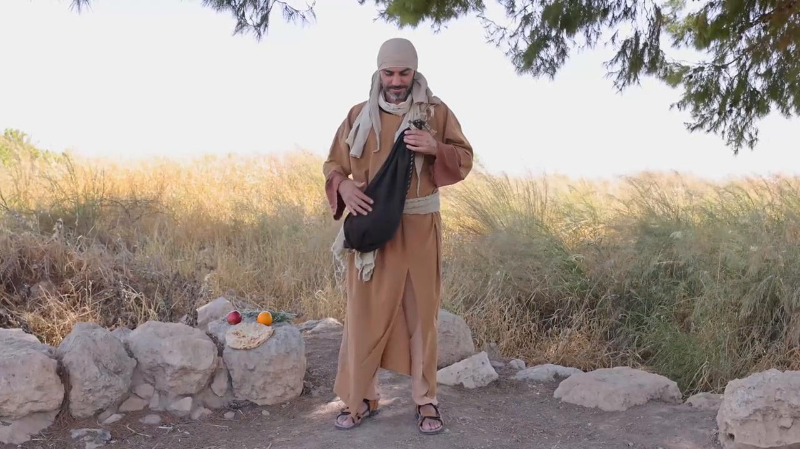
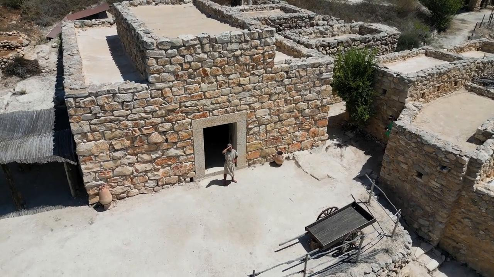

# Videos (Video Bible Dictionary)

**Video Bible Dictionary** © 2023 SRV Partners. Released under CC BY\-SA 4\.0 license. *Video Bible Dictionary* has been adapted in the following languages: Tok Pisin, عربي, Français, हिंदी, Bahasa Indonesia, Português, Русский, Español, Kiswahili, 简体中文 from *Video Bible Dictionary* © 2023 SRV Partners. Released under CC BY\-SA 4\.0 license by Mission Mutual

--------------------------------

## Sac de voyageur (id: a23)

### Video Content

 (47 seconds)

[link](https://s3.amazonaws.com/cbbt-er.public/media/videos/a23/720p.mp4)

* **Associated Passages:** Marc 6.6-13

## Sandales (id: a184)

### Video Content

 (56 seconds)

[link](https://s3.amazonaws.com/cbbt-er.public/media/videos/a184/720p.mp4)

* **Associated Passages:** Genèse 14.17-24; Exode 3.1-10; Deutéronome 25.1-10; Josué 5.10-15; 1 Rois 2.1-12; Matthieu 3.1-17; Marc 1.1-13; Marc 6.6-13; Luc 3.15-22; Luc 9.1-17; Luc 15.11-32; Jean 1.19-28; Jean 13.1-11; Actes 7.20-34; Actes 12.6-19

## synagogue (id: a186)

### Video Content

 (88 seconds)

[link](https://s3.amazonaws.com/cbbt-er.public/media/videos/a186/720p.mp4)

* **Associated Passages:** Deutéronome 17.14-20; Matthieu 4.12-25; Matthieu 6.1-8; Matthieu 10.16-25; Matthieu 12.1-14; Marc 1.21-28; Marc 2.23-3.6; Marc 5.21-34; Marc 6.1-6; Luc 4.14-30; Luc 4.31-44; Luc 6.1-11; Luc 7.1-10; Luc 12.1-12; Luc 13.10-17; Luc 21.12-19; Jean 6.52-59; Jean 9.24-34; Actes 13.13-22; Actes 14.1-7; Actes 17.1-9; Actes 19.8-10

