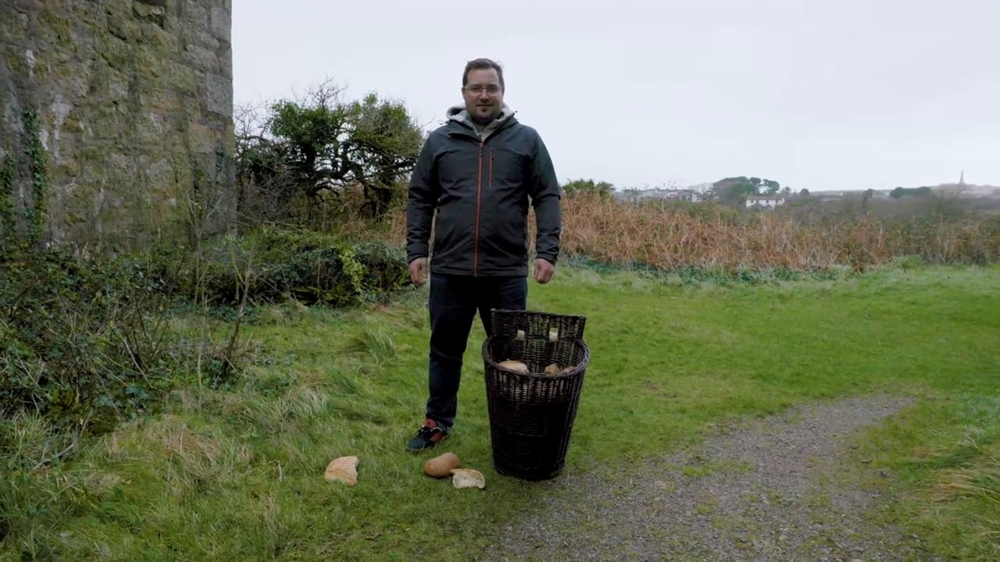
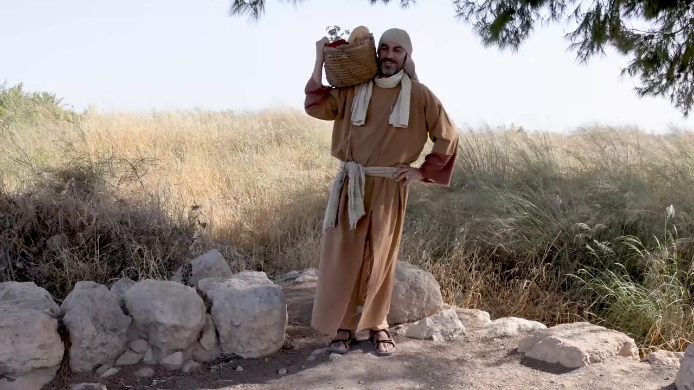
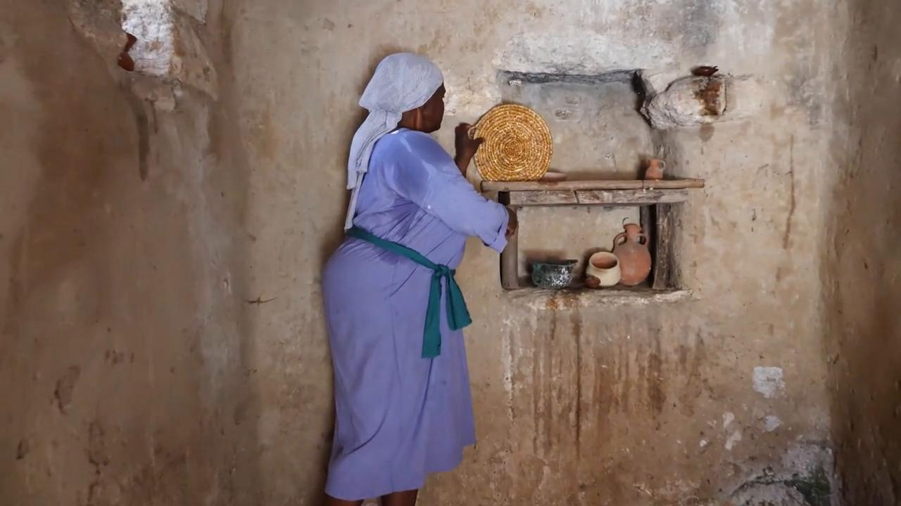
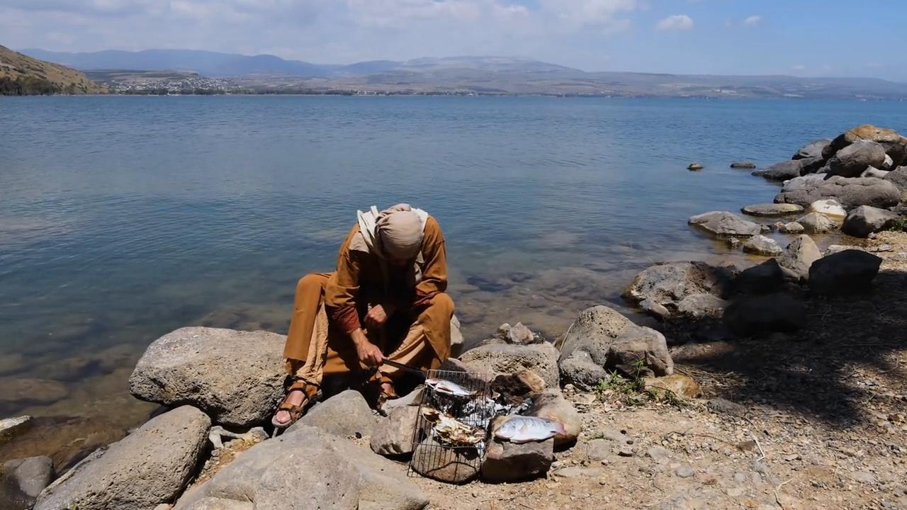
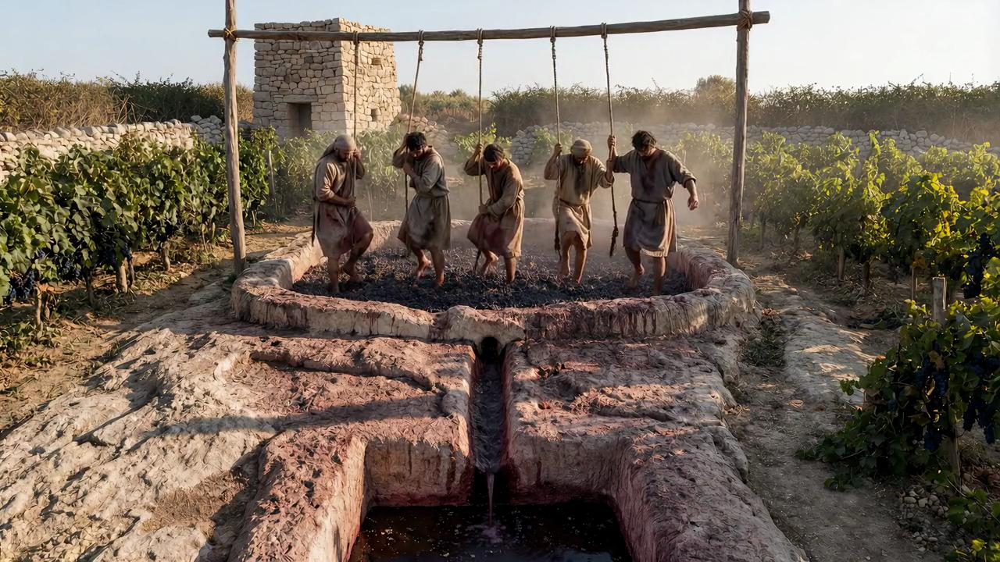
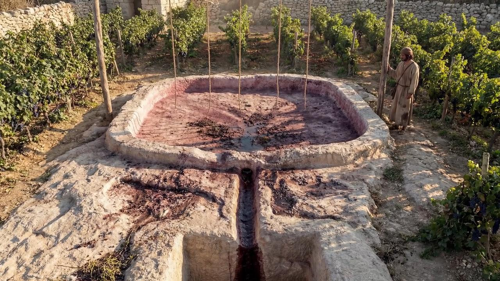

# Familiarization, Internalization, Articulation (FIA) Videos

**Video Bible Dictionary** © 2025 Word Collective. Released under CC BY\-SA 4\.0 license. *Video Bible Dictionary* has been adapted in the following languages: Tok Pisin, عربي, Français, हिंदी, Bahasa Indonesia, Português, Русский, Español, Kiswahili, 简体中文 from *Video Bible Dictionary* © 2025 Word Collective. Released under CC BY\-SA 4\.0 license by Mission Mutual

--------------------------------

## Panier de provisions (id: a1253)

### Video Content

 (88 seconds)

[link](https://s3.amazonaws.com/cbbt-er.public/media/videos/a1253/720p.mp4)

* **Associated Passages:** Matthieu 14.13-21; Matthieu 15.29-39; Marc 6.30-44; Marc 8.11-21; Jean 6.1-15

## Panier en tant boisseau (id: a30)

### Video Content

 (77 seconds)

[link](https://s3.amazonaws.com/cbbt-er.public/media/videos/a30/720p.mp4)

* **Associated Passages:** Deutéronome 28.1-6; Deutéronome 28.15-24; Matthieu 5.13-16; Marc 4.21-25

## Perles (id: a175)

### Video Content

 (75 seconds)

[link](https://s3.amazonaws.com/cbbt-er.public/media/videos/a175/720p.mp4)

* **Associated Passages:** Matthieu 7.1-12; Matthieu 13.44-53

## Pièces (id: a28)

### Video Content

 (65 seconds)

[link](https://s3.amazonaws.com/cbbt-er.public/media/videos/a28/720p.mp4)

* **Associated Passages:** Matthieu 25.14-30; Marc 6.6-13

## Pièces de cuivre (id: a29)

### Video Content

 (69 seconds)

[link](https://s3.amazonaws.com/cbbt-er.public/media/videos/a29/720p.mp4)

* **Associated Passages:** Matthieu 10.26-33; Marc 12.38-44; Luc 20.45-21.4

## Pierre à moudre (id: a32)

### Video Content

 (88 seconds)

[link](https://s3.amazonaws.com/cbbt-er.public/media/videos/a32/720p.mp4)

* **Associated Passages:** Juges 9.50-57; Juges 16.15-22; 2 Samuel 11.14-27; Matthieu 24.37-44; Marc 9.30-50; Luc 17.1-10

## Pierre d'angle (id: a181)

### Video Content

 (77 seconds)

[link](https://s3.amazonaws.com/cbbt-er.public/media/videos/a181/720p.mp4)

* **Associated Passages:** Matthieu 21.33-46; Marc 12.1-12; Luc 20.9-19; Actes 4.1-22; Éphésiens 2.19-22

## Plat (id: a180)

### Video Content

 (72 seconds)

[link](https://s3.amazonaws.com/cbbt-er.public/media/videos/a180/720p.mp4)

* **Associated Passages:** Marc 6.14-29

## Poisson cuit (id: a43)

### Video Content

 (81 seconds)

[link](https://s3.amazonaws.com/cbbt-er.public/media/videos/a43/720p.mp4)

* **Associated Passages:** Nombres 11.1-15; Matthieu 15.29-39; Marc 6.30-44; Marc 8.1-10; Luc 9.1-17

## Pot en albâtre (id: a41)

### Video Content

 (73 seconds)

[link](https://s3.amazonaws.com/cbbt-er.public/media/videos/a41/720p.mp4)

* **Associated Passages:** Matthieu 26.1-16; Marc 14.1-11; Luc 7.36-8.3

## Pressoir à vin (id: a2376)

### Video Content

 (0 seconds)

[link](https://s3.amazonaws.com/cbbt-er.public/media/videos/a2376/720p.mp4)

* **Associated Passages:** Nombres 18.25-32; Deutéronome 16.9-17; Juges 7.16-25; 1 Chroniques 27.25-31; Matthieu 21.33-46; Marc 12.1-12

## Pressoir à vin (id: a2377)

### Video Content

 (0 seconds)

[link](https://s3.amazonaws.com/cbbt-er.public/media/videos/a2377/720p.mp4)

* **Associated Passages:** Nombres 18.25-32; Deutéronome 16.9-17; Juges 7.16-25; 1 Chroniques 27.25-31; Matthieu 21.33-46; Marc 12.1-12

## Pressoir à vin (id: a2378)

### Video Content

 (0 seconds)

[link](https://s3.amazonaws.com/cbbt-er.public/media/videos/a2378/720p.mp4)

* **Associated Passages:** Nombres 18.25-32; Deutéronome 16.9-17; Juges 7.16-25; 1 Chroniques 27.25-31; Matthieu 21.33-46; Marc 12.1-12

## Pressoir à vin (id: a2379)

### Video Content

 (96 seconds)

[link](https://s3.amazonaws.com/cbbt-er.public/media/videos/a2379/720p.mp4)

* **Associated Passages:** Nombres 18.25-32; Deutéronome 16.9-17; Juges 7.16-25; 1 Chroniques 27.25-31; Matthieu 21.33-46; Marc 12.1-12

