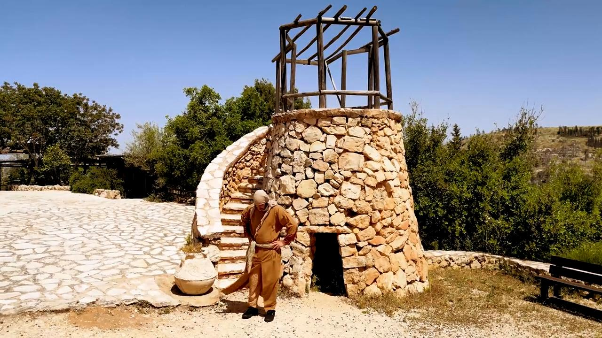

# Videos (Video Bible Dictionary)

**Video Bible Dictionary** © 2023 SRV Partners. Released under CC BY\-SA 4\.0 license. *Video Bible Dictionary* has been adapted in the following languages: Tok Pisin, عربي, Français, हिंदी, Bahasa Indonesia, Português, Русский, Español, Kiswahili, 简体中文 from *Video Bible Dictionary* © 2023 SRV Partners. Released under CC BY\-SA 4\.0 license by Mission Mutual

--------------------------------

## Tapis de couchage (id: a31)

### Video Content

 (59 seconds)

[link](https://s3.amazonaws.com/cbbt-er.public/media/videos/a31/720p.mp4)

* **Associated Passages:** Matthieu 9.1-8; Marc 2.1-12; Marc 6.45-56; Luc 5.17-26; Jean 5.1-15; Actes 5.12-16; Actes 9.32-35

## Tombeau de jardin (id: a35)

### Video Content

 (84 seconds)

[link](https://s3.amazonaws.com/cbbt-er.public/media/videos/a35/720p.mp4)

* **Associated Passages:** Juges 8.22-35; Marc 15.40-47; Marc 16.1-8

## Tombeaux (id: a8)

### Video Content

 (93 seconds)

[link](https://s3.amazonaws.com/cbbt-er.public/media/videos/a8/720p.mp4)

* **Associated Passages:** Genèse 23.1-20; Juges 8.22-35; Juges 16.23-31; 2 Samuel 3.31-39; 1 Rois 13.11-22; 2 Chroniques 16.1-14; 2 Chroniques 21.11-20; Néhémie 2.1-10; Matthieu 8.28-34; Matthieu 23.23-28; Matthieu 27.57-66; Matthieu 28.1-15; Marc 5.1-20; Marc 6.14-29; Marc 15.40-47; Luc 8.26-39; Luc 11.33-54; Luc 23.50-56; Luc 24.1-12; Jean 11.17-27; Jean 11.28-44; Jean 19.31-42; Jean 20.1-18; Actes 5.1-11; Actes 13.23-41

## Tour de guet d'une vigne (id: a36)

### Video Content

 (97 seconds)

[link](https://s3.amazonaws.com/cbbt-er.public/media/videos/a36/720p.mp4)

* **Associated Passages:** Genèse 35.21-29; 1 Chroniques 27.25-31; Matthieu 21.33-46; Marc 12.1-12; Luc 14.25-35

## Tunique (id: a4)

### Video Content

 (82 seconds)

[link](https://s3.amazonaws.com/cbbt-er.public/media/videos/a4/720p.mp4)

* **Associated Passages:** Juges 14.10-20; 2 Samuel 15.24-37; Esdras 9.1-4; Esdras 9.5-15; Matthieu 5.33-42; Marc 6.6-13; Luc 3.1-14; Luc 6.27-36; Luc 9.1-17; Jean 13.1-11; Jean 19.17-30; Actes 9.36-43

