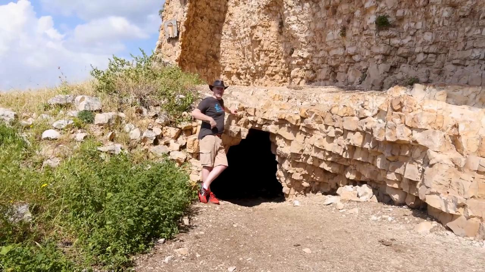

# Videos (Video Bible Dictionary)

**Video Bible Dictionary** © 2023 SRV Partners. Released under CC BY\-SA 4\.0 license. *Video Bible Dictionary* has been adapted in the following languages: Tok Pisin, عربي, Français, हिंदी, Bahasa Indonesia, Português, Русский, Español, Kiswahili, 简体中文 from *Video Bible Dictionary* © 2023 SRV Partners. Released under CC BY\-SA 4\.0 license by Mission Mutual

--------------------------------

## कड़वे सागपात (id: a39)

### Video Content

 (71 seconds)

[link](https://s3.amazonaws.com/cbbt-er.public/media/videos/a39/720p.mp4)

* **Associated Passages:** निर्गमन 12:1-13; गिनती 9:1-14; मत्ती 26:17-25; मरकुस 14:12-26

## कब्रें (id: a8)

### Video Content

 (93 seconds)

[link](https://s3.amazonaws.com/cbbt-er.public/media/videos/a8/720p.mp4)

* **Associated Passages:** उत्पत्ति 23:1-20; न्यायियों 8:22-35; न्यायियों 16:23-31; 2 शमूएल 3:31-39; 1 राजाओं 13:11-22; 2 इतिहास 16:1-14; 2 इतिहास 21:11-20; नहेम्याह 2:1-10; मत्ती 8:28-34; मत्ती 23:23-28; मत्ती 27:57-66; मत्ती 28:1-15; मरकुस 5:1-20; मरकुस 6:14-29; मरकुस 15:40-47; लूका 8:26-39; लूका 11:33-54; लूका 23:50-56; लूका 24:1-12; यूहन्ना 11:17-27; यूहन्ना 11:28-44; यूहन्ना 19:31-42; यूहन्ना 20:1-18; प्रेरितों के काम 5:1-11; प्रेरितों के काम 13:23-41

## कमर बाँधे हुआ मनुष्य (id: a1355)

### Video Content

 (67 seconds)

[link](https://s3.amazonaws.com/cbbt-er.public/media/videos/a1355/720p.mp4)

* **Associated Passages:** 1 राजाओं 18:41-46; लूका 12:35-48; प्रेरितों के काम 12:6-19

## कमरबन्द (id: a135)

### Video Content

 (71 seconds)

[link](https://s3.amazonaws.com/cbbt-er.public/media/videos/a135/720p.mp4)

* **Associated Passages:** प्रेरितों के काम 12:6-19; प्रेरितों के काम 21:10-14

## कुर्ता (id: a4)

### Video Content

 (82 seconds)

[link](https://s3.amazonaws.com/cbbt-er.public/media/videos/a4/720p.mp4)

* **Associated Passages:** न्यायियों 14:10-20; 2 शमूएल 15:24-37; एज्रा 9:1-4; एज्रा 9:5-15; मत्ती 5:33-42; मरकुस 6:6-13; लूका 3:1-14; लूका 6:27-36; लूका 9:1-17; यूहन्ना 13:1-11; यूहन्ना 19:17-30; प्रेरितों के काम 9:36-43

## कुल्हाड़ी (id: a182)

### Video Content

 (69 seconds)

[link](https://s3.amazonaws.com/cbbt-er.public/media/videos/a182/720p.mp4)

* **Associated Passages:** न्यायियों 9:42-49; 1 शमूएल 13:15-23; मत्ती 3:1-17

