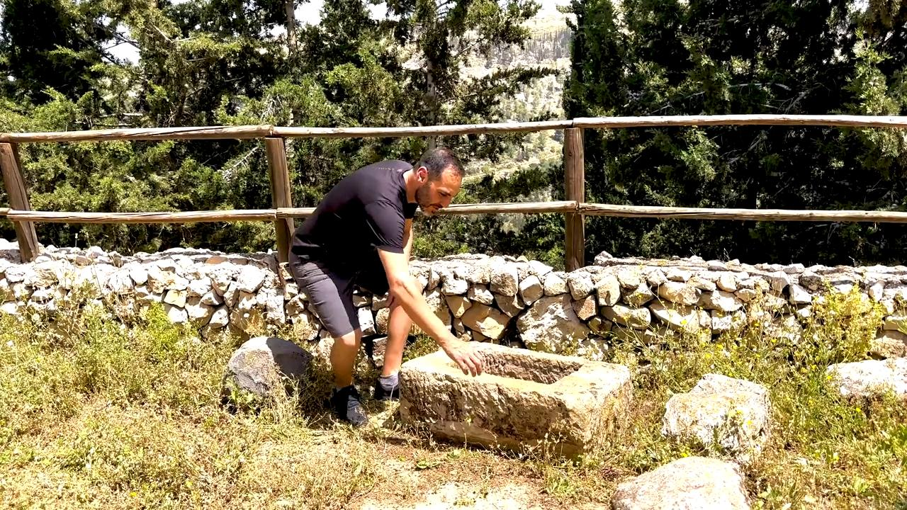
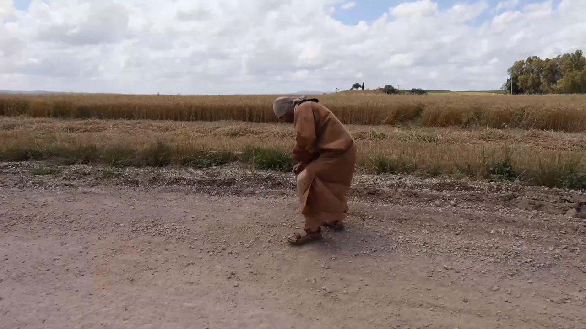

# Videos (Video Bible Dictionary)

**Video Bible Dictionary** © 2023 SRV Partners. Released under CC BY\-SA 4\.0 license. *Video Bible Dictionary* has been adapted in the following languages: Tok Pisin, عربي, Français, हिंदी, Bahasa Indonesia, Português, Русский, Español, Kiswahili, 简体中文 from *Video Bible Dictionary* © 2023 SRV Partners. Released under CC BY\-SA 4\.0 license by Mission Mutual

--------------------------------

## चक्की का पाट (id: a32)

### Video Content

 (88 seconds)

[link](https://s3.amazonaws.com/cbbt-er.public/media/videos/a32/720p.mp4)

* **Associated Passages:** न्यायियों 9:50-57; न्यायियों 16:15-22; 2 शमूएल 11:14-27; मत्ती 24:37-44; मरकुस 9:30-50; लूका 17:1-10

## चट्टानें (id: a12)

### Video Content

 (49 seconds)

[link](https://s3.amazonaws.com/cbbt-er.public/media/videos/a12/720p.mp4)

* **Associated Passages:** मत्ती 8:28-34; मरकुस 5:1-20

## चरनी (id: a33)

### Video Content

 (70 seconds)

[link](https://s3.amazonaws.com/cbbt-er.public/media/videos/a33/720p.mp4)

* **Associated Passages:** लूका 2:1-21

## चार प्रकार की मिट्टियाँ (id: a3)

### Video Content

 (89 seconds)

[link](https://s3.amazonaws.com/cbbt-er.public/media/videos/a3/720p.mp4)

* **Associated Passages:** मत्ती 13:1-9; मत्ती 13:18-23; मरकुस 4:1-20; लूका 8:4-15

