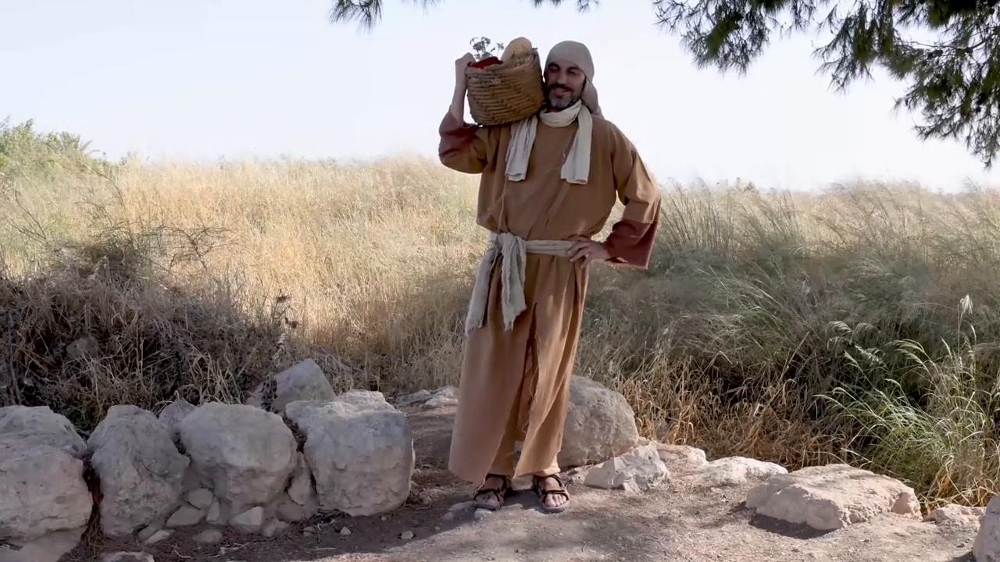

# Videos (Video Bible Dictionary)

**Video Bible Dictionary** © 2023 SRV Partners. Released under CC BY\-SA 4\.0 license. *Video Bible Dictionary* has been adapted in the following languages: Tok Pisin, عربي, Français, हिंदी, Bahasa Indonesia, Português, Русский, Español, Kiswahili, 简体中文 from *Video Bible Dictionary* © 2023 SRV Partners. Released under CC BY\-SA 4\.0 license by Mission Mutual

--------------------------------

## टाट (id: a139)

### Video Content

 (70 seconds)

[link](https://s3.amazonaws.com/cbbt-er.public/media/videos/a139/720p.mp4)

* **Associated Passages:** उत्पत्ति 37:12-36; 2 शमूएल 3:31-39; 2 शमूएल 21:1-14; 1 राजाओं 20:23-34; 1 राजाओं 21:17-29; 1 इतिहास 21:7-17; मत्ती 11:20-24; लूका 10:1-16

## टोकरी पैमाने के रूप में (id: a30)

### Video Content

 (77 seconds)

[link](https://s3.amazonaws.com/cbbt-er.public/media/videos/a30/720p.mp4)

* **Associated Passages:** मत्ती 5:13-16; मरकुस 4:21-25

