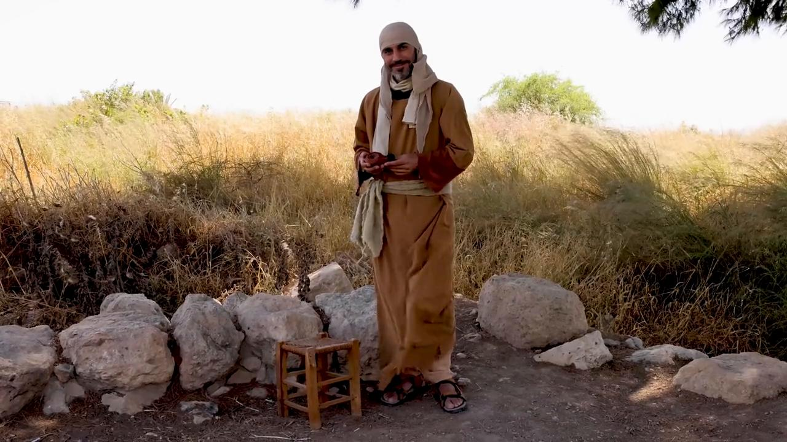

# Videos (Video Bible Dictionary)

**Video Bible Dictionary** © 2023 SRV Partners. Released under CC BY\-SA 4\.0 license. *Video Bible Dictionary* has been adapted in the following languages: Tok Pisin, عربي, Français, हिंदी, Bahasa Indonesia, Português, Русский, Español, Kiswahili, 简体中文 from *Video Bible Dictionary* © 2023 SRV Partners. Released under CC BY\-SA 4\.0 license by Mission Mutual

--------------------------------

## दीवट (id: a21)

### Video Content

 (84 seconds)

[link](https://s3.amazonaws.com/cbbt-er.public/media/videos/a21/720p.mp4)

* **Associated Passages:** मत्ती 5:13-16; मरकुस 4:21-25; लूका 8:16-18

## दीवार के साथ कोने का पत्थर (id: a181)

### Video Content

 (77 seconds)

[link](https://s3.amazonaws.com/cbbt-er.public/media/videos/a181/720p.mp4)

* **Associated Passages:** इफिसियों 2:19-22

