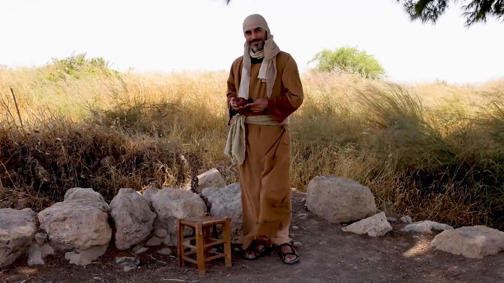
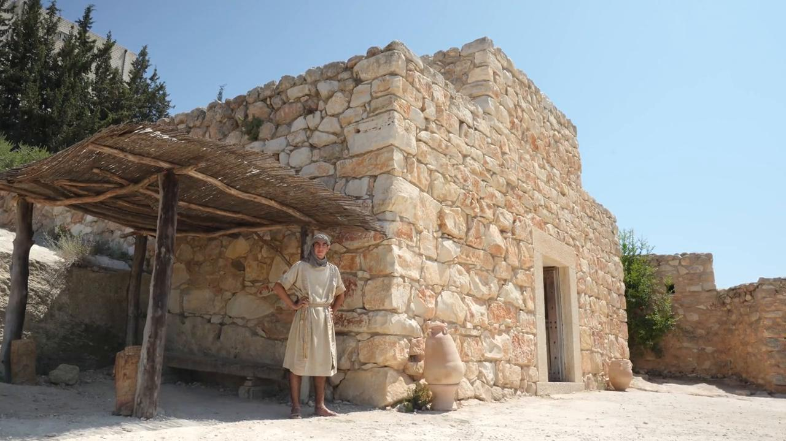

# Familiarization, Internalization, Articulation (FIA) Videos

**Video Bible Dictionary** © 2025 Word Collective. Released under CC BY\-SA 4\.0 license. *Video Bible Dictionary* has been adapted in the following languages: Tok Pisin, عربي, Français, हिंदी, Bahasa Indonesia, Português, Русский, Español, Kiswahili, 简体中文 from *Video Bible Dictionary* © 2025 Word Collective. Released under CC BY\-SA 4\.0 license by Mission Mutual

--------------------------------

## दाखरस के कुण्ड (id: a2376)

### Video Content

 (0 seconds)

[link](https://s3.amazonaws.com/cbbt-er.public/media/videos/a2376/720p.mp4)

* **Associated Passages:** गिनती 18:25-32; व्यवस्थाविवरण 16:9-17; न्यायियों 7:16-25; 1 इतिहास 27:25-31; मत्ती 21:33-46; मरकुस 12:1-12

## दाखरस के कुण्ड (id: a2377)

### Video Content

 (0 seconds)

[link](https://s3.amazonaws.com/cbbt-er.public/media/videos/a2377/720p.mp4)

* **Associated Passages:** गिनती 18:25-32; व्यवस्थाविवरण 16:9-17; न्यायियों 7:16-25; 1 इतिहास 27:25-31; मत्ती 21:33-46; मरकुस 12:1-12

## दाखरस के कुण्ड (id: a2378)

### Video Content

 (0 seconds)

[link](https://s3.amazonaws.com/cbbt-er.public/media/videos/a2378/720p.mp4)

* **Associated Passages:** गिनती 18:25-32; व्यवस्थाविवरण 16:9-17; न्यायियों 7:16-25; 1 इतिहास 27:25-31; मत्ती 21:33-46; मरकुस 12:1-12

## दाखरस के कुण्ड (id: a2379)

### Video Content

 (96 seconds)

[link](https://s3.amazonaws.com/cbbt-er.public/media/videos/a2379/720p.mp4)

* **Associated Passages:** गिनती 18:25-32; व्यवस्थाविवरण 16:9-17; न्यायियों 7:16-25; 1 इतिहास 27:25-31; मत्ती 21:33-46; मरकुस 12:1-12

## दीवट (id: a21)

### Video Content

 (84 seconds)

[link](https://s3.amazonaws.com/cbbt-er.public/media/videos/a21/720p.mp4)

* **Associated Passages:** मत्ती 5:13-16; मरकुस 4:21-25; लूका 8:16-18

## दीवार के साथ कोने का पत्थर (id: a181)

### Video Content

 (77 seconds)

[link](https://s3.amazonaws.com/cbbt-er.public/media/videos/a181/720p.mp4)

* **Associated Passages:** लूका 20:9-19; इफिसियों 2:19-22

