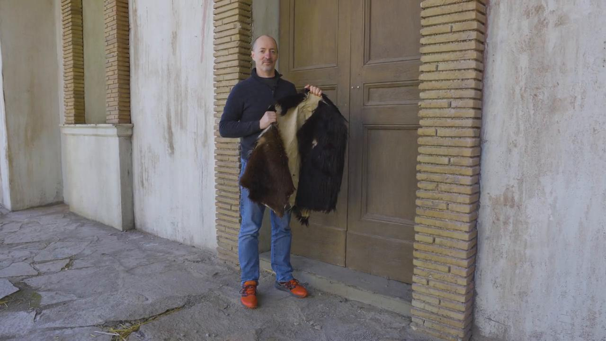
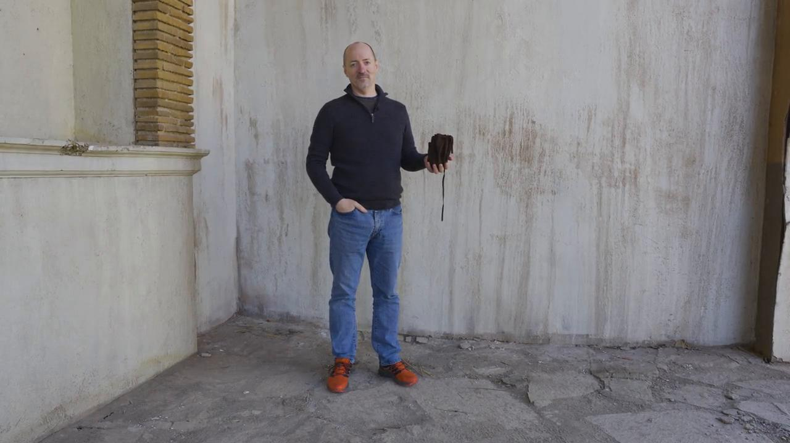

# Videos (Video Bible Dictionary)

**Video Bible Dictionary** © 2023 SRV Partners. Released under CC BY\-SA 4\.0 license. *Video Bible Dictionary* has been adapted in the following languages: Tok Pisin, عربي, Français, हिंदी, Bahasa Indonesia, Português, Русский, Español, Kiswahili, 简体中文 from *Video Bible Dictionary* © 2023 SRV Partners. Released under CC BY\-SA 4\.0 license by Mission Mutual

--------------------------------

## बकरी की खाल (id: a1352)

### Video Content

 (81 seconds)

[link](https://s3.amazonaws.com/cbbt-er.public/media/videos/a1352/720p.mp4)

* **Associated Passages:** उत्पत्ति 26:34-27:17; 1 शमूएल 19:11-24

## बगीचे की कब्र (id: a35)

### Video Content

 (84 seconds)

[link](https://s3.amazonaws.com/cbbt-er.public/media/videos/a35/720p.mp4)

* **Associated Passages:** न्यायियों 8:22-35; मरकुस 15:40-47; मरकुस 16:1-8

## बटुआ (id: a1351)

### Video Content

 (71 seconds)

[link](https://s3.amazonaws.com/cbbt-er.public/media/videos/a1351/720p.mp4)

* **Associated Passages:** 1 शमूएल 25:23-38; लूका 12:22-34

## बर्फ (id: a1262)

### Video Content

 (79 seconds)

[link](https://s3.amazonaws.com/cbbt-er.public/media/videos/a1262/720p.mp4)

* **Associated Passages:** गिनती 12:1-16; 2 शमूएल 23:18-23; 1 इतिहास 11:20-25; मत्ती 28:1-15

## बलिदान के पशु (id: a169)

### Video Content

 (91 seconds)

[link](https://s3.amazonaws.com/cbbt-er.public/media/videos/a169/720p.mp4)

* **Associated Passages:** गिनती 7:84-89; मत्ती 21:12-22

