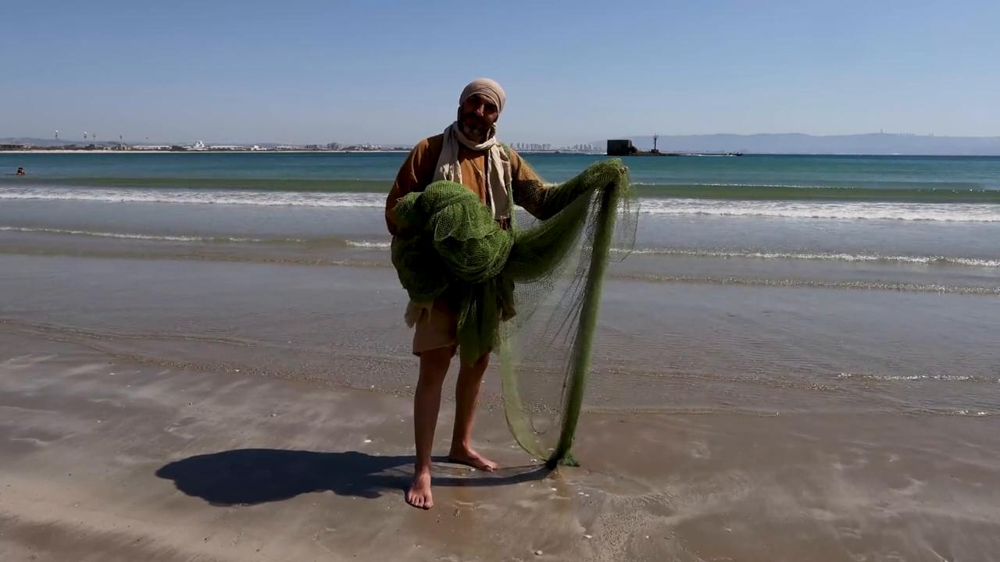

# Videos (Video Bible Dictionary)

**Video Bible Dictionary** © 2023 SRV Partners. Released under CC BY\-SA 4\.0 license. *Video Bible Dictionary* has been adapted in the following languages: Tok Pisin, عربي, Français, हिंदी, Bahasa Indonesia, Português, Русский, Español, Kiswahili, 简体中文 from *Video Bible Dictionary* © 2023 SRV Partners. Released under CC BY\-SA 4\.0 license by Mission Mutual

--------------------------------

## मछली की पंखुड़ी (id: a129)

### Video Content

 (72 seconds)

[link](https://s3.amazonaws.com/cbbt-er.public/media/videos/a129/720p.mp4)

* **Associated Passages:** लैव्यव्यवस्था 11:9-12; प्रेरितों के काम 9:1-19

## मछली पकड़ने का जाल (id: a19)

### Video Content

 (82 seconds)

[link](https://s3.amazonaws.com/cbbt-er.public/media/videos/a19/720p.mp4)

* **Associated Passages:** लैव्यव्यवस्था 11:9-12; मत्ती 4:12-25; मत्ती 13:44-53; मरकुस 1:14-20; लूका 5:1-11; यूहन्ना 21:1-14

## मशक (id: a6)

### Video Content

 (59 seconds)

[link](https://s3.amazonaws.com/cbbt-er.public/media/videos/a6/720p.mp4)

* **Associated Passages:** यहोशू 9:1-15; 1 शमूएल 1:19-28; 1 शमूएल 16:14-23; 1 शमूएल 25:14-22; 2 शमूएल 16:1-4; एज्रा 7:11-28; मत्ती 9:14-17; मरकुस 2:18-22; लूका 5:27-39

## महीन मलमल का कपड़ा (id: a1350)

### Video Content

 (68 seconds)

[link](https://s3.amazonaws.com/cbbt-er.public/media/videos/a1350/720p.mp4)

* **Associated Passages:** उत्पत्ति 41:37-57; निर्गमन 25:1-9; निर्गमन 26:1-14; निर्गमन 27:9-21; निर्गमन 28:1-14; निर्गमन 35:1-19; निर्गमन 38:9-20; निर्गमन 39:1-7; लैव्यव्यवस्था 19:19-25; 1 इतिहास 4:21-23

## मिस्र का वस्त्र (id: a133)

### Video Content

 (72 seconds)

[link](https://s3.amazonaws.com/cbbt-er.public/media/videos/a133/720p.mp4)

* **Associated Passages:** निर्गमन 4:1-17

## मुर्गा (id: a1388)

### Video Content

 (5 seconds)

[link](https://s3.amazonaws.com/cbbt-er.public/media/videos/a1388/720p.mp4)

* **Associated Passages:** मत्ती 26:26-35; मत्ती 26:69-75; मरकुस 14:27-31; मरकुस 14:66-72; लूका 22:24-38; लूका 22:47-62; यूहन्ना 13:31-38; यूहन्ना 18:15-27

## मोती (id: a175)

### Video Content

 (75 seconds)

[link](https://s3.amazonaws.com/cbbt-er.public/media/videos/a175/720p.mp4)

* **Associated Passages:** मत्ती 7:1-12; मत्ती 13:44-53

