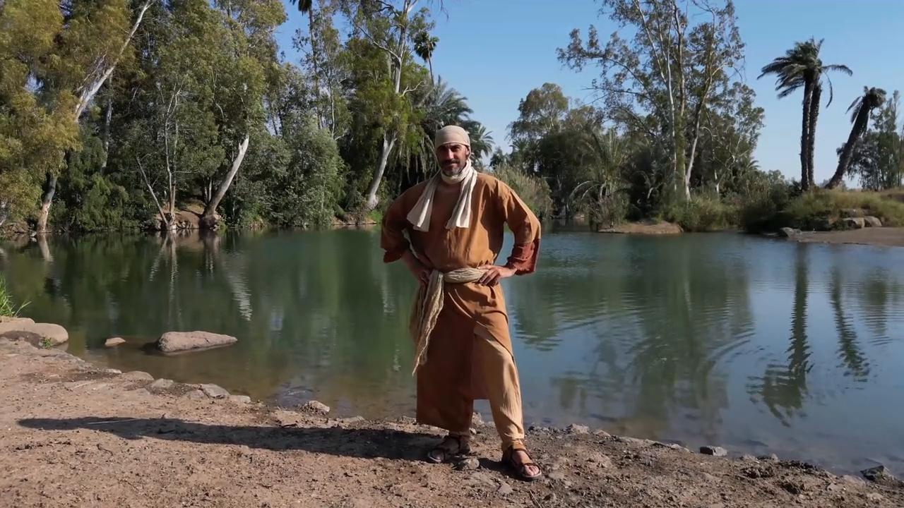

# Videos (Video Bible Dictionary)

**Video Bible Dictionary** © 2023 SRV Partners. Released under CC BY\-SA 4\.0 license. *Video Bible Dictionary* has been adapted in the following languages: Tok Pisin, عربي, Français, हिंदी, Bahasa Indonesia, Português, Русский, Español, Kiswahili, 简体中文 from *Video Bible Dictionary* © 2023 SRV Partners. Released under CC BY\-SA 4\.0 license by Mission Mutual

--------------------------------

## यरदन नदी (id: a13)

### Video Content

 (79 seconds)

[link](https://s3.amazonaws.com/cbbt-er.public/media/videos/a13/720p.mp4)

* **Associated Passages:** व्यवस्थाविवरण 6:1-9; व्यवस्थाविवरण 9:1-6; यहोशू 12:1-6; न्यायियों 8:1-3; 1 शमूएल 13:1-14; मरकुस 1:1-13; लूका 3:1-14

## यहूदी घर का प्रवेश द्वार (id: a148)

### Video Content

 (88 seconds)

[link](https://s3.amazonaws.com/cbbt-er.public/media/videos/a148/720p.mp4)

* **Associated Passages:** लूका 13:22-30

## यात्री का झोला (id: a23)

### Video Content

 (47 seconds)

[link](https://s3.amazonaws.com/cbbt-er.public/media/videos/a23/720p.mp4)

* **Associated Passages:** मरकुस 6:6-13

## यीशु के समय के घर (id: a145)

### Video Content

 (87 seconds)

[link](https://s3.amazonaws.com/cbbt-er.public/media/videos/a145/720p.mp4)

* **Associated Passages:** 1 शमूएल 9:15-27; मत्ती 10:26-33; मत्ती 24:15-28; मत्ती 24:37-44; मरकुस 2:1-12; मरकुस 13:9-23; लूका 5:17-26; लूका 12:1-12; प्रेरितों के काम 9:36-43; प्रेरितों के काम 10:9-23

## यूसुफ का अंगरखा (id: a1354)

### Video Content

 (88 seconds)

[link](https://s3.amazonaws.com/cbbt-er.public/media/videos/a1354/720p.mp4)

* **Associated Passages:** उत्पत्ति 37:1-11; उत्पत्ति 37:12-36

