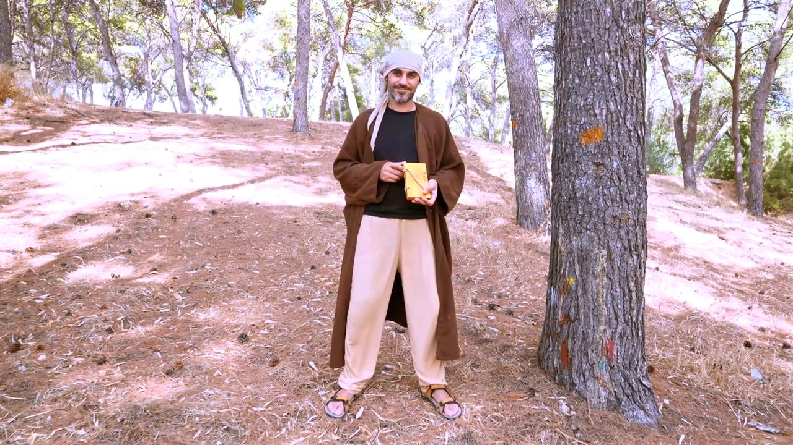
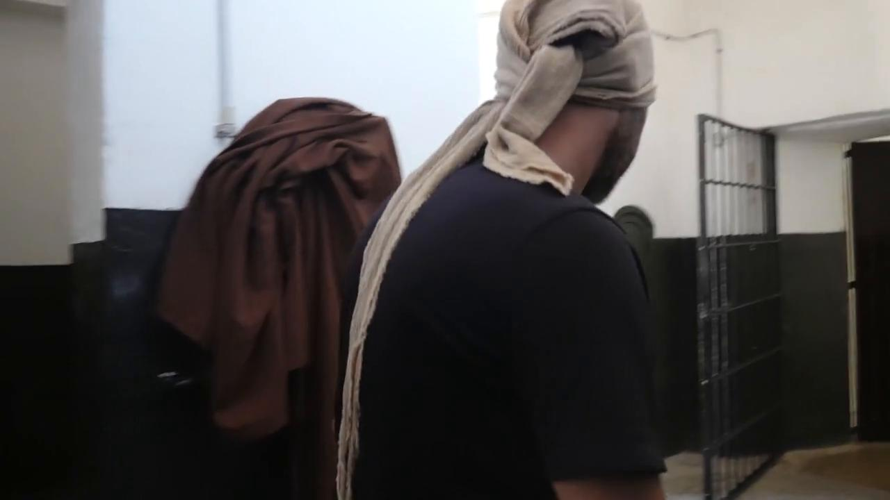

# Videos (Video Bible Dictionary)

**Video Bible Dictionary** © 2023 SRV Partners. Released under CC BY\-SA 4\.0 license. *Video Bible Dictionary* has been adapted in the following languages: Tok Pisin, عربي, Français, हिंदी, Bahasa Indonesia, Português, Русский, Español, Kiswahili, 简体中文 from *Video Bible Dictionary* © 2023 SRV Partners. Released under CC BY\-SA 4\.0 license by Mission Mutual

--------------------------------

## लाठी (id: a166)

### Video Content

 (53 seconds)

[link](https://s3.amazonaws.com/cbbt-er.public/media/videos/a166/720p.mp4)

* **Associated Passages:** निर्गमन 4:1-17; निर्गमन 4:18-31; निर्गमन 8:16-19; निर्गमन 9:22-35; निर्गमन 10:1-20; निर्गमन 17:1-7; निर्गमन 21:18-27; गिनती 17:1-13; गिनती 22:22-40; 1 शमूएल 17:31-40; 1 शमूएल 17:41-54; मरकुस 6:6-13

## लाठी (id: a25)

### Video Content

 (74 seconds)

[link](https://s3.amazonaws.com/cbbt-er.public/media/videos/a25/720p.mp4)

* **Associated Passages:** निर्गमन 21:18-27; मत्ती 26:47-56; मरकुस 14:43-52

## लेखन पट्टिका (id: a118)

### Video Content

 (72 seconds)

[link](https://s3.amazonaws.com/cbbt-er.public/media/videos/a118/720p.mp4)

* **Associated Passages:** लूका 1:57-80

## लोहे का फाटक (id: a14)

### Video Content

 (59 seconds)

[link](https://s3.amazonaws.com/cbbt-er.public/media/videos/a14/720p.mp4)

* **Associated Passages:** व्यवस्थाविवरण 6:1-9; व्यवस्थाविवरण 25:1-10; प्रेरितों के काम 12:6-19

