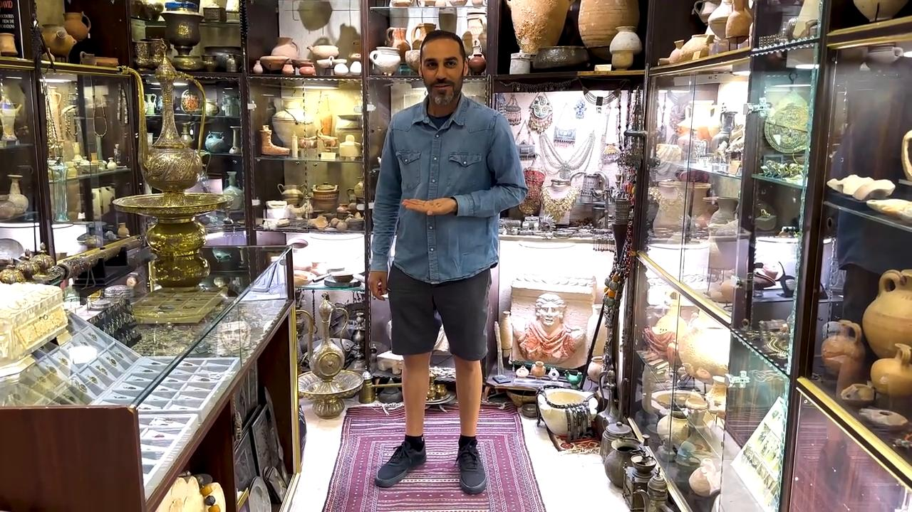

# Videos (Video Bible Dictionary)

**Video Bible Dictionary** © 2023 SRV Partners. Released under CC BY\-SA 4\.0 license. *Video Bible Dictionary* has been adapted in the following languages: Tok Pisin, عربي, Français, हिंदी, Bahasa Indonesia, Português, Русский, Español, Kiswahili, 简体中文 from *Video Bible Dictionary* © 2023 SRV Partners. Released under CC BY\-SA 4\.0 license by Mission Mutual

--------------------------------

## संगमरमर का पात्र (id: a41)

### Video Content

 (73 seconds)

[link](https://s3.amazonaws.com/cbbt-er.public/media/videos/a41/720p.mp4)

* **Associated Passages:** मत्ती 26:1-16; मरकुस 14:1-11; लूका 7:36-8:3

## सरकंडे का पौधा (id: a187)

### Video Content

 (82 seconds)

[link](https://s3.amazonaws.com/cbbt-er.public/media/videos/a187/720p.mp4)

* **Associated Passages:** 1 राजाओं 14:12-20; मत्ती 11:7-19; मत्ती 12:15-21; लूका 7:18-35

## सामान रखने की टोकरी (id: a1253)

### Video Content

 (88 seconds)

[link](https://s3.amazonaws.com/cbbt-er.public/media/videos/a1253/720p.mp4)

* **Associated Passages:** मत्ती 14:13-21; मत्ती 15:29-39; मरकुस 6:30-44; मरकुस 8:11-21; यूहन्ना 6:1-15

## सिक्के (id: a28)

### Video Content

 (65 seconds)

[link](https://s3.amazonaws.com/cbbt-er.public/media/videos/a28/720p.mp4)

* **Associated Passages:** मत्ती 25:14-30; मरकुस 6:6-13

## सोने के लिए चटाई (id: a31)

### Video Content

 (59 seconds)

[link](https://s3.amazonaws.com/cbbt-er.public/media/videos/a31/720p.mp4)

* **Associated Passages:** मत्ती 9:1-8; मरकुस 2:1-12; मरकुस 6:45-56; लूका 5:17-26; यूहन्ना 5:1-15; प्रेरितों के काम 5:12-16; प्रेरितों के काम 9:32-35

