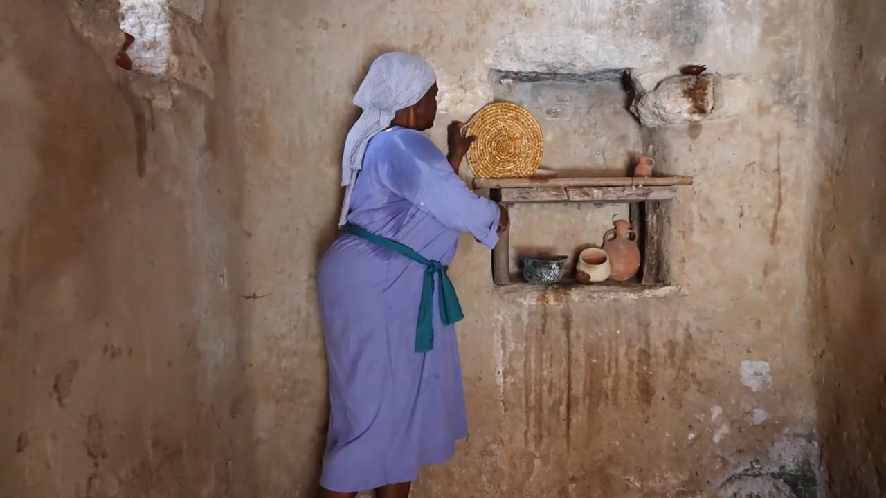

# Videos (Video Bible Dictionary)

**Video Bible Dictionary** © 2023 SRV Partners. Released under CC BY\-SA 4\.0 license. *Video Bible Dictionary* has been adapted in the following languages: Tok Pisin, عربي, Français, हिंदी, Bahasa Indonesia, Português, Русский, Español, Kiswahili, 简体中文 from *Video Bible Dictionary* © 2023 SRV Partners. Released under CC BY\-SA 4\.0 license by Mission Mutual

--------------------------------

## Bandeja (id: a180)

### Video Content

 (72 seconds)

[link](https://s3.amazonaws.com/cbbt-er.public/media/videos/a180/720p.mp4)

* **Associated Passages:** Marcos 6:14-29

## Bolsa (id: a1351)

### Video Content

 (71 seconds)

[link](https://s3.amazonaws.com/cbbt-er.public/media/videos/a1351/720p.mp4)

* **Associated Passages:** 1 Samuel 25:23-38; Lucas 12:22-34

## Bolsa de viajante (id: a23)

### Video Content

 (47 seconds)

[link](https://s3.amazonaws.com/cbbt-er.public/media/videos/a23/720p.mp4)

* **Associated Passages:** Marcos 6:6-13

