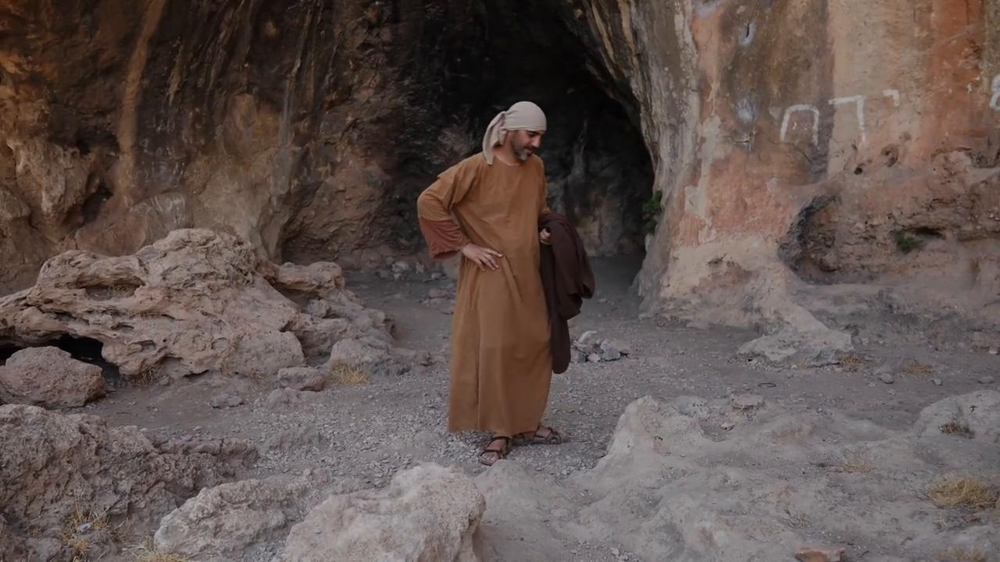
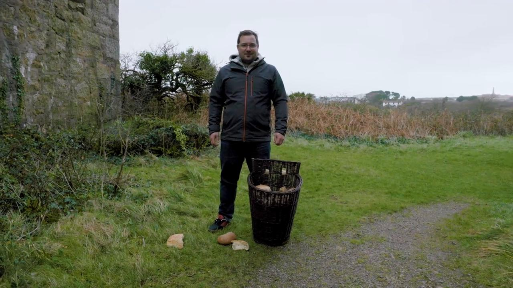
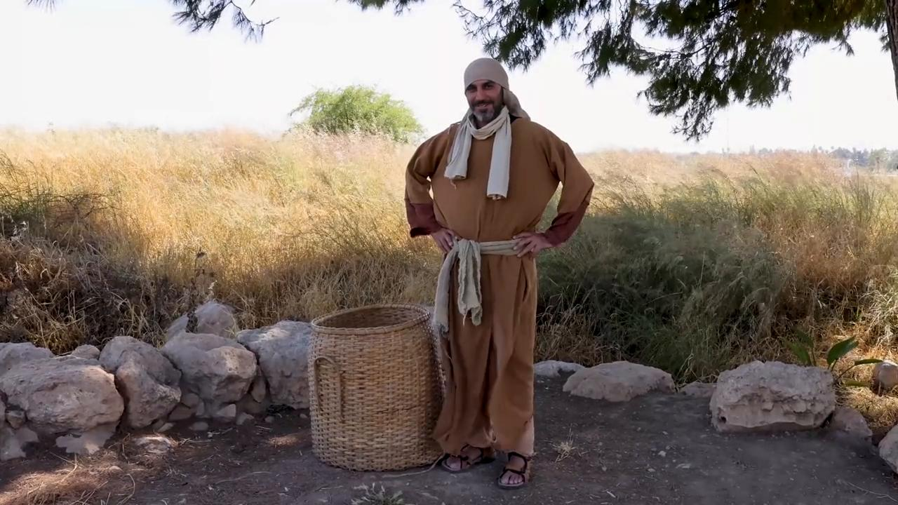

# Videos (Video Bible Dictionary)

**Video Bible Dictionary** © 2023 SRV Partners. Released under CC BY\-SA 4\.0 license. *Video Bible Dictionary* has been adapted in the following languages: Tok Pisin, عربي, Français, हिंदी, Bahasa Indonesia, Português, Русский, Español, Kiswahili, 简体中文 from *Video Bible Dictionary* © 2023 SRV Partners. Released under CC BY\-SA 4\.0 license by Mission Mutual

--------------------------------

## Cajado (id: a166)

### Video Content

 (53 seconds)

[link](https://s3.amazonaws.com/cbbt-er.public/media/videos/a166/720p.mp4)

* **Associated Passages:** Êxodo 4:1-17; Êxodo 4:18-31; Êxodo 8:16-19; Êxodo 9:22-35; Êxodo 10:1-20; Êxodo 17:1-7; Êxodo 21:18-27; Números 17:1-13; Números 22:22-40; 1 Samuel 17:31-40; 1 Samuel 17:41-54; Marcos 6:6-13

## Camelo (id: a9)

### Video Content

 (58 seconds)

[link](https://s3.amazonaws.com/cbbt-er.public/media/videos/a9/720p.mp4)

* **Associated Passages:** Gênesis 24:1-14; Gênesis 24:15-28; Gênesis 24:29-49; Gênesis 32:1-21; Levítico 11:1-8; Juízes 6:1-10; Juízes 7:9-15; Juízes 8:4-21; 1 Samuel 15:1-9; 1 Samuel 27:1-28:2; 1 Reis 9:26-10:13; 1 Crônicas 12:23-40; 1 Crônicas 27:25-31; 2 Crônicas 9:1-12; Esdras 2:64-70; Mateus 3:1-17; Mateus 19:13-30; Mateus 23:23-28; Marcos 10:13-31; Lucas 18:18-30

## Capa (id: a133)

### Video Content

 (72 seconds)

[link](https://s3.amazonaws.com/cbbt-er.public/media/videos/a133/720p.mp4)

* **Associated Passages:** Êxodo 3:11-22; Êxodo 4:1-17; Êxodo 22:7-15; Êxodo 22:25-31; Deuteronômio 24:10-16; Juízes 14:10-20; 1 Reis 11:26-43; 1 Reis 18:41-46; Esdras 9:1-4; Esdras 9:5-15; Mateus 5:33-42; Mateus 24:15-28; Marcos 5:21-34; Marcos 10:46-52; Marcos 11:1-11; Marcos 13:9-23; Lucas 6:27-36; Lucas 19:28-44; Lucas 22:24-38; João 13:1-11; Atos 9:36-43; Atos 22:22-29; 2 Timóteo 4:9-22

## Casa no tempo de Jesus (id: a145)

### Video Content

 (87 seconds)

[link](https://s3.amazonaws.com/cbbt-er.public/media/videos/a145/720p.mp4)

* **Associated Passages:** 1 Samuel 9:15-27; Mateus 10:26-33; Mateus 24:15-28; Mateus 24:37-44; Marcos 2:1-12; Marcos 13:9-23; Lucas 5:17-26; Lucas 12:1-12; Atos 9:36-43; Atos 10:9-23

## Caverna (id: a141)

### Video Content

 (94 seconds)

[link](https://s3.amazonaws.com/cbbt-er.public/media/videos/a141/720p.mp4)

* **Associated Passages:** Gênesis 19:30-38; Josué 10:16-28; Juízes 6:1-10; Juízes 15:1-8; Juízes 15:9-20; 1 Samuel 24:1-7; 2 Samuel 17:15-29; 1 Reis 18:1-15; 1 Reis 19:9-21; Lucas 19:45-20:8

## Cesta como alqueire (id: a30)

### Video Content

 (77 seconds)

[link](https://s3.amazonaws.com/cbbt-er.public/media/videos/a30/720p.mp4)

* **Associated Passages:** Mateus 5:13-16; Marcos 4:21-25

## Cesta de mantimentos (id: a1253)

### Video Content

 (88 seconds)

[link](https://s3.amazonaws.com/cbbt-er.public/media/videos/a1253/720p.mp4)

* **Associated Passages:** Mateus 14:13-21; Mateus 15:29-39; Marcos 6:30-44; Marcos 8:11-21; João 6:1-15

## Cesta grande (id: a27)

### Video Content

 (83 seconds)

[link](https://s3.amazonaws.com/cbbt-er.public/media/videos/a27/720p.mp4)

* **Associated Passages:** Mateus 15:29-39; Marcos 8:1-10; Marcos 8:11-21; Atos 9:19-31

## Cinto (id: a135)

### Video Content

 (71 seconds)

[link](https://s3.amazonaws.com/cbbt-er.public/media/videos/a135/720p.mp4)

* **Associated Passages:** Atos 12:6-19; Atos 21:10-14

## Correntes (id: a26)

### Video Content

 (73 seconds)

[link](https://s3.amazonaws.com/cbbt-er.public/media/videos/a26/720p.mp4)

* **Associated Passages:** Marcos 5:1-20; Lucas 8:26-39

