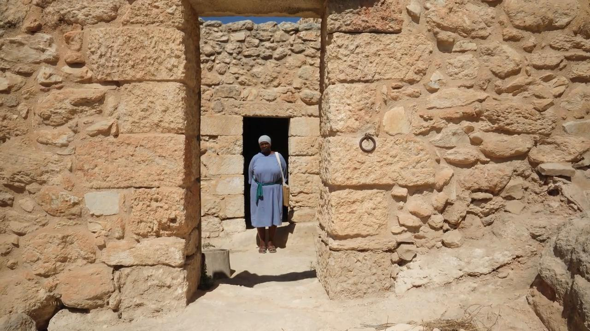
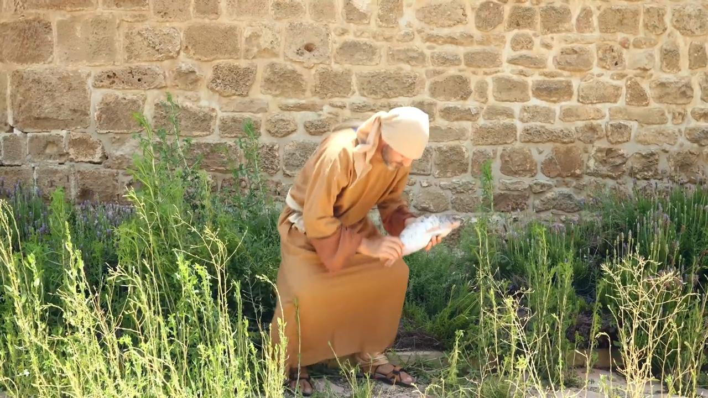
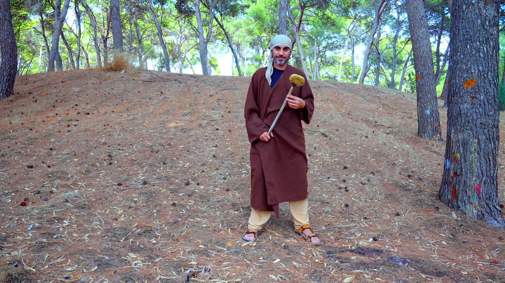
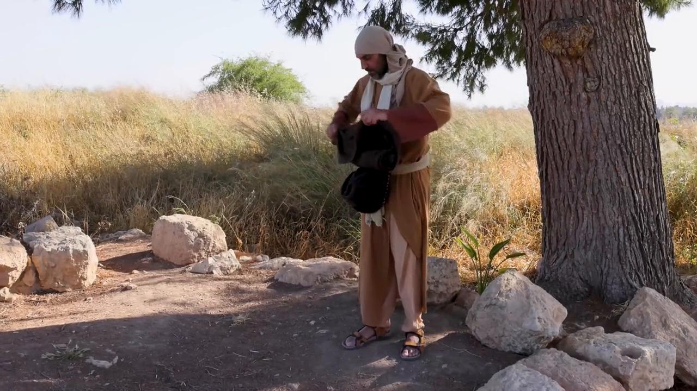

# Videos (Video Bible Dictionary)

**Video Bible Dictionary** © 2023 SRV Partners. Released under CC BY\-SA 4\.0 license. *Video Bible Dictionary* has been adapted in the following languages: Tok Pisin, عربي, Français, हिंदी, Bahasa Indonesia, Português, Русский, Español, Kiswahili, 简体中文 from *Video Bible Dictionary* © 2023 SRV Partners. Released under CC BY\-SA 4\.0 license by Mission Mutual

--------------------------------

## Entrada de uma casa judaica (id: a148)

### Video Content

 (88 seconds)

[link](https://s3.amazonaws.com/cbbt-er.public/media/videos/a148/720p.mp4)

* **Associated Passages:** Lucas 13:22-30

## Ermo ou deserto (id: a10)

### Video Content

 (55 seconds)

[link](https://s3.amazonaws.com/cbbt-er.public/media/videos/a10/720p.mp4)

* **Associated Passages:** Êxodo 3:1-10; Êxodo 3:11-22; Êxodo 17:1-7; Levítico 16:15-22; Números 14:26-38; Números 21:10-20; Números 34:1-15; Josué 15:13-19; Josué 15:48-63; Juízes 1:9-17; 1 Samuel 25:1-13; 1 Samuel 26:1-12; 2 Samuel 2:18-3:1; 2 Samuel 15:13-23; Mateus 3:1-17; Mateus 4:1-11; Mateus 24:15-28; Marcos 1:1-13; Marcos 8:1-10; Lucas 1:57-80; Lucas 3:1-14; Lucas 4:1-13; Lucas 5:12-16; Lucas 7:18-35; João 1:19-28; Atos 7:35-43; Atos 7:44-53; 1 Coríntios 10:1-13

## Ervas amargas (id: a39)

### Video Content

 (71 seconds)

[link](https://s3.amazonaws.com/cbbt-er.public/media/videos/a39/720p.mp4)

* **Associated Passages:** Êxodo 12:1-13; Números 9:1-14; Mateus 26:17-25; Marcos 14:12-26

## Escamas de peixe (id: a129)

### Video Content

 (72 seconds)

[link](https://s3.amazonaws.com/cbbt-er.public/media/videos/a129/720p.mp4)

* **Associated Passages:** Levítico 11:9-12; Atos 9:1-19

## Esponja com vinho em uma vara (id: a1381)

### Video Content

 (73 seconds)

[link](https://s3.amazonaws.com/cbbt-er.public/media/videos/a1381/720p.mp4)

* **Associated Passages:** Marcos 15:33-39; João 19:17-30

## Esteira de dormir (id: a31)

### Video Content

 (59 seconds)

[link](https://s3.amazonaws.com/cbbt-er.public/media/videos/a31/720p.mp4)

* **Associated Passages:** Mateus 9:1-8; Marcos 2:1-12; Marcos 6:45-56; Lucas 5:17-26; João 5:1-15; Atos 5:12-16; Atos 9:32-35

