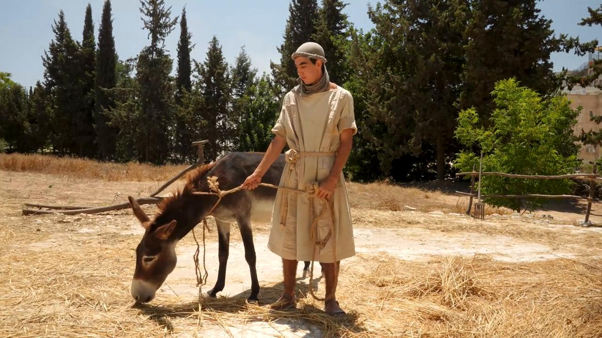

# Videos (Video Bible Dictionary)

**Video Bible Dictionary** © 2023 SRV Partners. Released under CC BY\-SA 4\.0 license. *Video Bible Dictionary* has been adapted in the following languages: Tok Pisin, عربي, Français, हिंदी, Bahasa Indonesia, Português, Русский, Español, Kiswahili, 简体中文 from *Video Bible Dictionary* © 2023 SRV Partners. Released under CC BY\-SA 4\.0 license by Mission Mutual

--------------------------------

## Jardim do Getsêmani (id: a37)

### Video Content

 (108 seconds)

[link](https://s3.amazonaws.com/cbbt-er.public/media/videos/a37/720p.mp4)

* **Associated Passages:** Mateus 26:36-46; Marcos 14:32-42

## Jumento adulto (id: a1269)

### Video Content

 (89 seconds)

[link](https://s3.amazonaws.com/cbbt-er.public/media/videos/a1269/720p.mp4)

* **Associated Passages:** Gênesis 22:1-19; Gênesis 24:29-49; Gênesis 32:1-21; Êxodo 4:18-31; Êxodo 9:1-7; Êxodo 13:1-16; Êxodo 20:8-17; Êxodo 22:1-6; Êxodo 22:7-15; Êxodo 23:1-9; Números 31:25-54; Josué 9:1-15; Josué 15:13-19; Juízes 1:9-17; Juízes 6:1-10; Juízes 10:1-5; Juízes 12:8-15; Juízes 15:9-20; 1 Samuel 8:10-22; 1 Samuel 9:1-14; 1 Samuel 12:1-17; 1 Samuel 15:1-9; 1 Samuel 27:1-28:2; 1 Reis 13:11-22; 1 Reis 13:23-34; 1 Crônicas 12:23-40; 1 Crônicas 27:25-31; 2 Crônicas 28:9-15; Esdras 2:64-70; Jó 1:13-22; Lucas 13:10-17; Lucas 19:28-44; João 12:12-19

