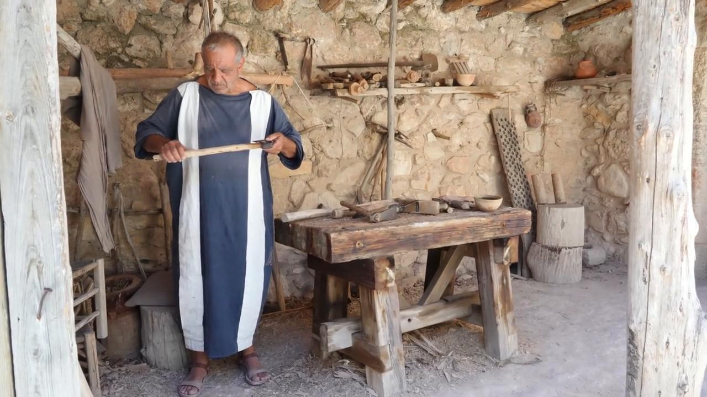
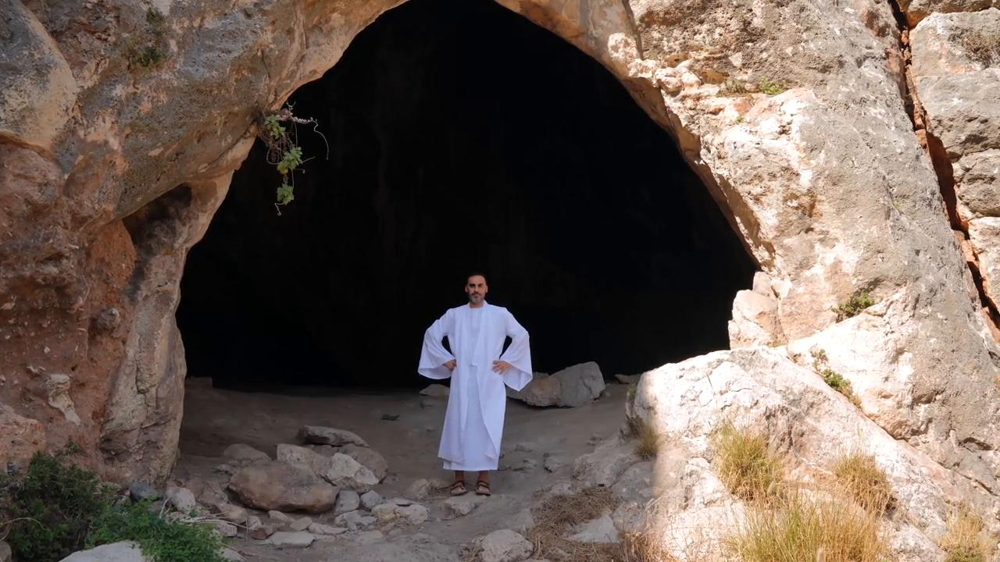
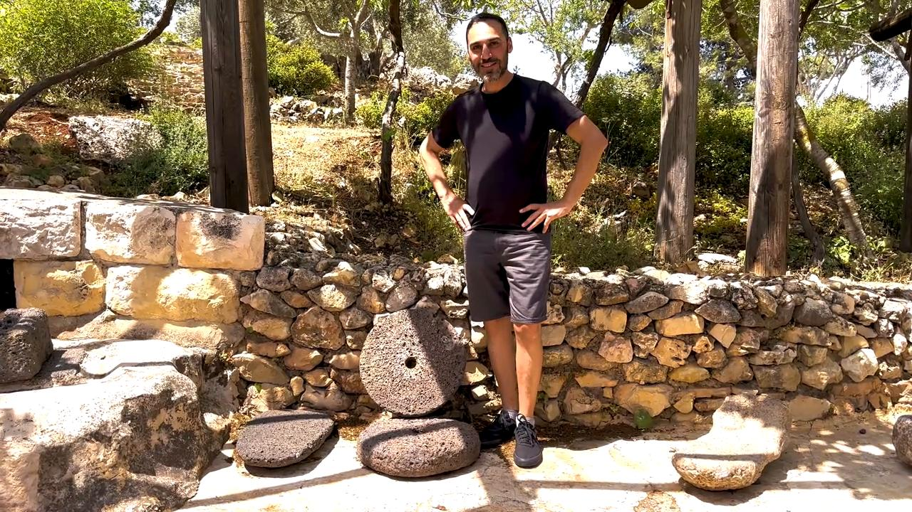

# Videos (Video Bible Dictionary)

**Video Bible Dictionary** © 2023 SRV Partners. Released under CC BY\-SA 4\.0 license. *Video Bible Dictionary* has been adapted in the following languages: Tok Pisin, عربي, Français, हिंदी, Bahasa Indonesia, Português, Русский, Español, Kiswahili, 简体中文 from *Video Bible Dictionary* © 2023 SRV Partners. Released under CC BY\-SA 4\.0 license by Mission Mutual

--------------------------------

## Machado (id: a182)

### Video Content

 (69 seconds)

[link](https://s3.amazonaws.com/cbbt-er.public/media/videos/a182/720p.mp4)

* **Associated Passages:** Juízes 9:42-49; 1 Samuel 13:15-23; Mateus 3:1-17

## Manjedoura (id: a33)

### Video Content

 (70 seconds)

[link](https://s3.amazonaws.com/cbbt-er.public/media/videos/a33/720p.mp4)

* **Associated Passages:** Lucas 2:1-21

## Manto branco (id: a131)

### Video Content

 (76 seconds)

[link](https://s3.amazonaws.com/cbbt-er.public/media/videos/a131/720p.mp4)

* **Associated Passages:** Marcos 16:1-8

## Manto roxo (id: a1356)

### Video Content

 (89 seconds)

[link](https://s3.amazonaws.com/cbbt-er.public/media/videos/a1356/720p.mp4)

* **Associated Passages:** Marcos 15:16-32; Lucas 16:19-31; João 19:1-16

## Mar da Galileia (id: a11)

### Video Content

 (114 seconds)

[link](https://s3.amazonaws.com/cbbt-er.public/media/videos/a11/720p.mp4)

* **Associated Passages:** Mateus 4:12-25; Mateus 8:23-27; Mateus 8:28-34; Mateus 14:13-21; Mateus 14:22-36; Marcos 1:14-20; Marcos 1:21-28; Marcos 4:1-20; Marcos 4:21-25; Marcos 4:26-34; Marcos 4:35-41; Marcos 5:21-34; Lucas 8:22-25; Lucas 8:26-39; João 6:16-21; João 6:28-40

## Mó de moinho (id: a32)

### Video Content

 (88 seconds)

[link](https://s3.amazonaws.com/cbbt-er.public/media/videos/a32/720p.mp4)

* **Associated Passages:** Juízes 9:50-57; Juízes 16:15-22; 2 Samuel 11:14-27; Mateus 24:37-44; Marcos 9:30-50; Lucas 17:1-10

## Moedas (id: a28)

### Video Content

 (65 seconds)

[link](https://s3.amazonaws.com/cbbt-er.public/media/videos/a28/720p.mp4)

* **Associated Passages:** Mateus 25:14-30; Marcos 6:6-13

## Moedas de cobre (id: a29)

### Video Content

 (69 seconds)

[link](https://s3.amazonaws.com/cbbt-er.public/media/videos/a29/720p.mp4)

* **Associated Passages:** Mateus 10:26-33; Marcos 12:38-44; Lucas 20:45-21:4

## Monte das Oliveiras (id: a40)

### Video Content

 (90 seconds)

[link](https://s3.amazonaws.com/cbbt-er.public/media/videos/a40/720p.mp4)

* **Associated Passages:** 2 Samuel 16:1-4; Mateus 21:1-11; Mateus 24:3-14; Mateus 24:29-36; Mateus 24:37-44; Mateus 24:45-51; Mateus 26:26-35; Marcos 11:1-11; Marcos 13:1-8; Marcos 13:24-31; Marcos 13:32-37; Marcos 14:12-26; Lucas 19:28-44; Lucas 22:39-46; João 8:1-11; Atos 1:12-14

## Muro de pedras ao redor de uma vinha (id: a34)

### Video Content

 (71 seconds)

[link](https://s3.amazonaws.com/cbbt-er.public/media/videos/a34/720p.mp4)

* **Associated Passages:** Mateus 21:33-46; Marcos 12:1-12

