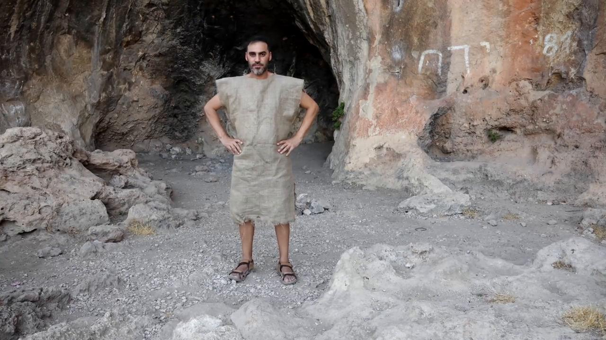
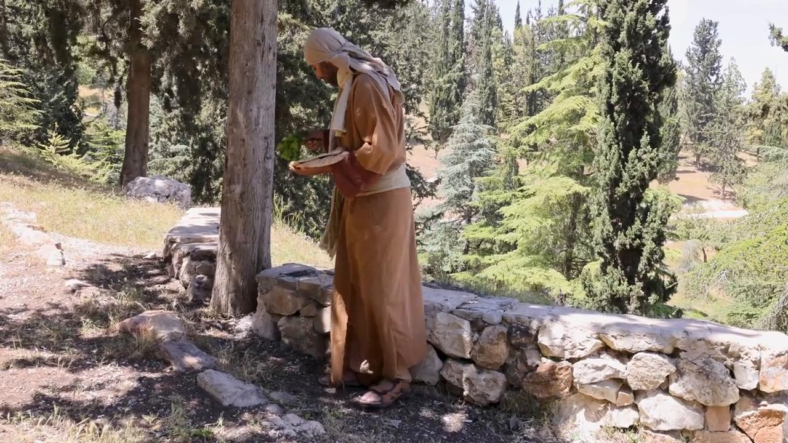
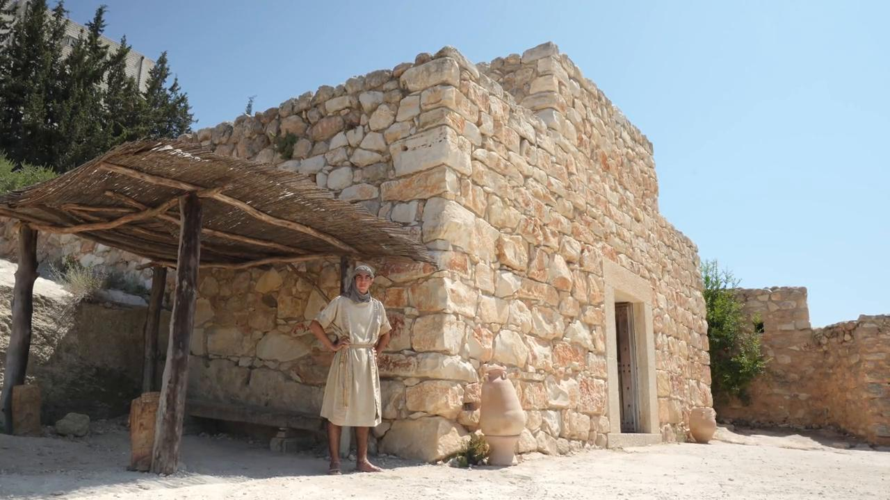
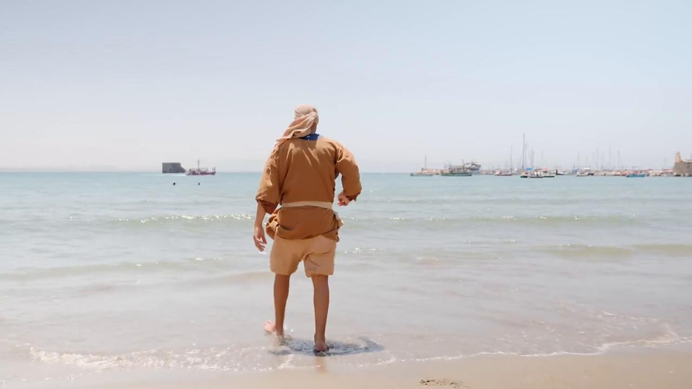

# Videos (Video Bible Dictionary)

**Video Bible Dictionary** © 2023 SRV Partners. Released under CC BY\-SA 4\.0 license. *Video Bible Dictionary* has been adapted in the following languages: Tok Pisin, عربي, Français, हिंदी, Bahasa Indonesia, Português, Русский, Español, Kiswahili, 简体中文 from *Video Bible Dictionary* © 2023 SRV Partners. Released under CC BY\-SA 4\.0 license by Mission Mutual

--------------------------------

## Pá de joeirar (id: a24)

### Video Content

 (75 seconds)

[link](https://s3.amazonaws.com/cbbt-er.public/media/videos/a24/720p.mp4)

* **Associated Passages:** 1 Crônicas 13:1-14; Salmos 1:1-6; Mateus 3:1-17; Lucas 3:15-22

## Pano de saco (id: a139)

### Video Content

 (70 seconds)

[link](https://s3.amazonaws.com/cbbt-er.public/media/videos/a139/720p.mp4)

* **Associated Passages:** Gênesis 37:12-36; 2 Samuel 3:31-39; 2 Samuel 21:1-14; 1 Reis 20:23-34; 1 Reis 21:17-29; 1 Crônicas 21:7-17; Mateus 11:20-24; Lucas 10:1-16

## Pão sem fermento (id: a38)

### Video Content

 (71 seconds)

[link](https://s3.amazonaws.com/cbbt-er.public/media/videos/a38/720p.mp4)

* **Associated Passages:** Gênesis 18:1-15; Gênesis 25:19-34; Êxodo 12:14-28; Êxodo 29:1-9; Êxodo 29:19-28; Números 9:1-14; Números 11:1-15; Números 28:16-25; Juízes 6:11-27; 1 Samuel 28:15-25; Mateus 26:17-25; Mateus 26:26-35; Marcos 14:1-11; Marcos 14:12-26; Atos 12:1-5; Atos 20:7-12; Atos 22:22-29; 1 Coríntios 10:14-22; 1 Coríntios 11:17-26

## Pedra angular (id: a181)

### Video Content

 (77 seconds)

[link](https://s3.amazonaws.com/cbbt-er.public/media/videos/a181/720p.mp4)

* **Associated Passages:** Mateus 21:33-46; Marcos 12:1-12; Atos 4:1-22; Efésios 2:19-22

## Peixe (id: a127)

### Video Content

 (85 seconds)

[link](https://s3.amazonaws.com/cbbt-er.public/media/videos/a127/720p.mp4)

* **Associated Passages:** Números 11:16-30; Mateus 4:12-25; Mateus 7:1-12; Marcos 6:30-44; João 21:1-14

## Peixe cozido (id: a43)

### Video Content

 (81 seconds)

[link](https://s3.amazonaws.com/cbbt-er.public/media/videos/a43/720p.mp4)

* **Associated Passages:** Números 11:1-15; Mateus 15:29-39; Marcos 6:30-44; Marcos 8:1-10; Lucas 9:1-17

## Penhascos (id: a12)

### Video Content

 (49 seconds)

[link](https://s3.amazonaws.com/cbbt-er.public/media/videos/a12/720p.mp4)

* **Associated Passages:** Mateus 8:28-34; Marcos 5:1-20

## Pérolas (id: a175)

### Video Content

 (75 seconds)

[link](https://s3.amazonaws.com/cbbt-er.public/media/videos/a175/720p.mp4)

* **Associated Passages:** Mateus 7:1-12; Mateus 13:44-53

## Planta de junco (id: a187)

### Video Content

 (82 seconds)

[link](https://s3.amazonaws.com/cbbt-er.public/media/videos/a187/720p.mp4)

* **Associated Passages:** 1 Reis 14:12-20; Mateus 11:7-19; Mateus 12:15-21; Lucas 7:18-35

## Portão da cidade (id: a125)

### Video Content

 (118 seconds)

[link](https://s3.amazonaws.com/cbbt-er.public/media/videos/a125/720p.mp4)

* **Associated Passages:** Gênesis 19:1-29; Gênesis 34:18-31; Deuteronômio 5:12-21; Juízes 1:18-26; 2 Samuel 15:1-12; 1 Reis 4:1-19; 1 Reis 16:29-34; 1 Reis 22:1-12; Lucas 7:11-17

## Portão de ferro (id: a14)

### Video Content

 (59 seconds)

[link](https://s3.amazonaws.com/cbbt-er.public/media/videos/a14/720p.mp4)

* **Associated Passages:** Deuteronômio 6:1-9; Deuteronômio 25:1-10; Atos 12:6-19

