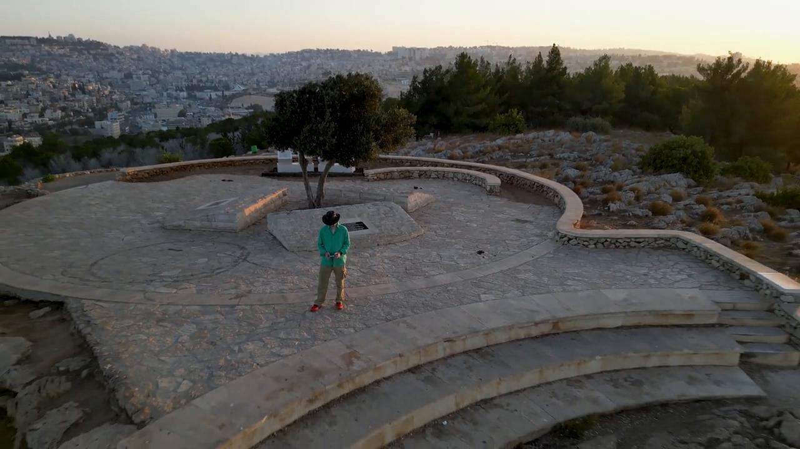
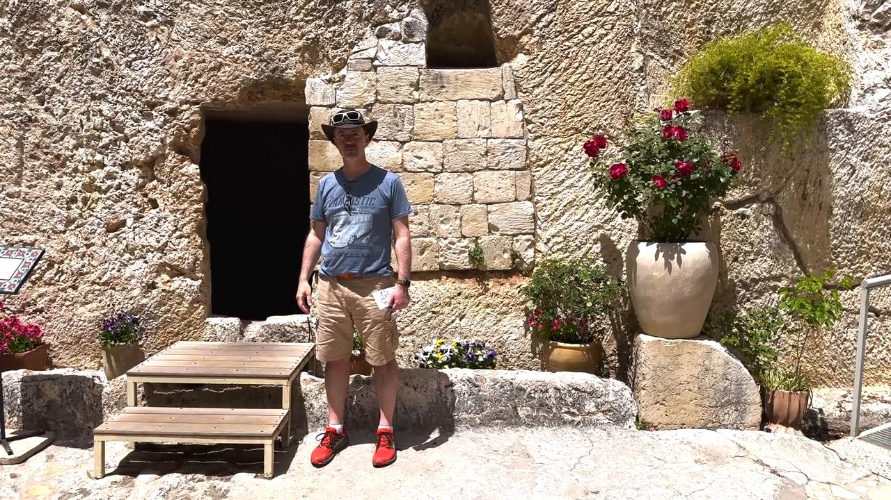

# Videos (Video Bible Dictionary)

**Video Bible Dictionary** © 2023 SRV Partners. Released under CC BY\-SA 4\.0 license. *Video Bible Dictionary* has been adapted in the following languages: Tok Pisin, عربي, Français, हिंदी, Bahasa Indonesia, Português, Русский, Español, Kiswahili, 简体中文 from *Video Bible Dictionary* © 2023 SRV Partners. Released under CC BY\-SA 4\.0 license by Mission Mutual

--------------------------------

## Tabuinha (id: a118)

### Video Content

 (72 seconds)

[link](https://s3.amazonaws.com/cbbt-er.public/media/videos/a118/720p.mp4)

* **Associated Passages:** Lucas 1:57-80

## Topo da colina (id: a143)

### Video Content

 (101 seconds)

[link](https://s3.amazonaws.com/cbbt-er.public/media/videos/a143/720p.mp4)

* **Associated Passages:** Lucas 4:14-30

## Torre de vigia para uma vinha (id: a36)

### Video Content

 (97 seconds)

[link](https://s3.amazonaws.com/cbbt-er.public/media/videos/a36/720p.mp4)

* **Associated Passages:** Gênesis 35:21-29; 1 Crônicas 27:25-31; Mateus 21:33-46; Marcos 12:1-12; Lucas 14:25-35

## Trigo com espigas (id: a2)

### Video Content

 (131 seconds)

[link](https://s3.amazonaws.com/cbbt-er.public/media/videos/a2/720p.mp4)

* **Associated Passages:** Levítico 6:19-23; 1 Reis 5:1-12; Mateus 12:1-14; Marcos 2:23-3:6; Lucas 6:1-11; 1 Coríntios 15:35-41

## Trigo pronto para a colheita (id: a1)

### Video Content

 (79 seconds)

[link](https://s3.amazonaws.com/cbbt-er.public/media/videos/a1/720p.mp4)

* **Associated Passages:** Gênesis 41:1-36; Êxodo 22:1-6; Levítico 6:19-23; Números 15:1-16; Números 20:1-13; Juízes 6:11-27; Juízes 15:1-8; 1 Samuel 12:1-17; 2 Samuel 4:1-12; 2 Samuel 17:15-29; 1 Reis 5:1-12; 1 Crônicas 21:18-22:1; 2 Crônicas 27:1-9; Mateus 3:1-17; Mateus 13:18-23; Marcos 1:40-45; Marcos 4:1-20; Lucas 3:15-22; Lucas 8:4-15; João 12:20-36; 1 Coríntios 15:35-41

## Túmulo do jardim (id: a35)

### Video Content

 (84 seconds)

[link](https://s3.amazonaws.com/cbbt-er.public/media/videos/a35/720p.mp4)

* **Associated Passages:** Juízes 8:22-35; Marcos 15:40-47; Marcos 16:1-8

## Túmulos (id: a8)

### Video Content

 (93 seconds)

[link](https://s3.amazonaws.com/cbbt-er.public/media/videos/a8/720p.mp4)

* **Associated Passages:** Gênesis 23:1-20; Juízes 8:22-35; Juízes 16:23-31; 2 Samuel 3:31-39; 1 Reis 13:11-22; 2 Crônicas 21:11-20; Neemias 2:1-10; Mateus 8:28-34; Mateus 23:23-28; Mateus 27:57-66; Mateus 28:1-15; Marcos 5:1-20; Marcos 6:14-29; Marcos 15:40-47; Lucas 8:26-39; Lucas 11:33-54; Lucas 23:50-56; Lucas 24:1-12; João 11:17-27; João 11:28-44; João 19:31-42; João 20:1-18; Atos 5:1-11; Atos 13:23-41

## Túnica (id: a4)

### Video Content

 (82 seconds)

[link](https://s3.amazonaws.com/cbbt-er.public/media/videos/a4/720p.mp4)

* **Associated Passages:** Juízes 14:10-20; 2 Samuel 15:24-37; Mateus 5:33-42; Marcos 6:6-13; Lucas 3:1-14; Lucas 6:27-36; Lucas 9:1-17; João 13:1-11; João 19:17-30; Atos 9:36-43

