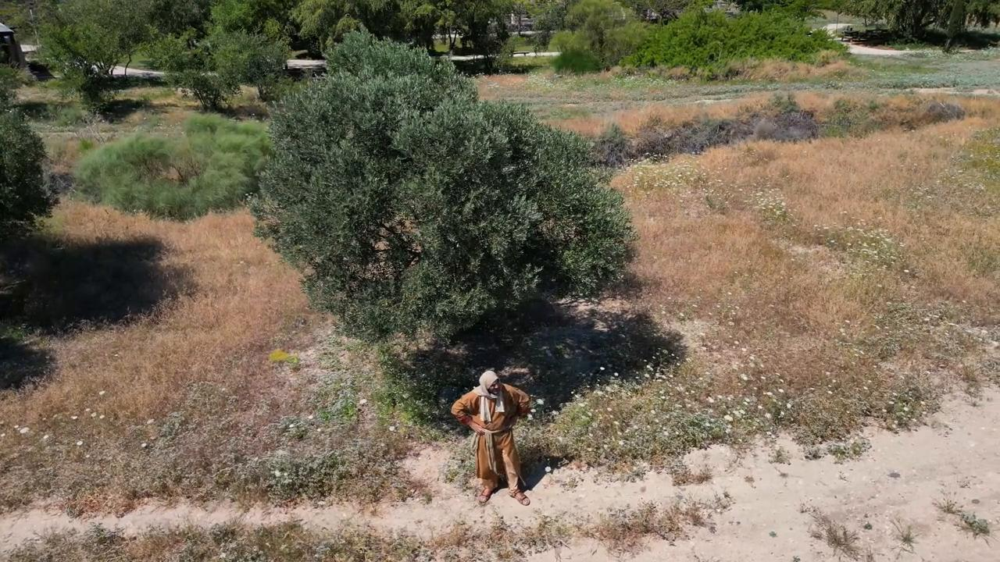

# Videos (Video Bible Dictionary)

**Video Bible Dictionary** © 2023 SRV Partners. Released under CC BY\-SA 4\.0 license. *Video Bible Dictionary* has been adapted in the following languages: Tok Pisin, عربي, Français, हिंदी, Bahasa Indonesia, Português, Русский, Español, Kiswahili, 简体中文 from *Video Bible Dictionary* © 2023 SRV Partners. Released under CC BY\-SA 4\.0 license by Mission Mutual

--------------------------------

## Acantilados (id: a12)

### Video Content

 (49 seconds)

[link](https://s3.amazonaws.com/cbbt-er.public/media/videos/a12/720p.mp4)

* **Associated Passages:** Mateo 8:28-34; Marcos 5:1-20

## Arando un campo (id: a1404)

### Video Content

 (0 seconds)

[link](https://s3.amazonaws.com/cbbt-er.public/media/videos/a1404/720p.mp4)

* **Associated Passages:** Génesis 45:1-28; Jueces 14:10-20; 1 Samuel 13:15-23; Mateo 13:1-9; Marcos 4:1-20; Lucas 9:46-62

## Árbol de olivo (id: a44)

### Video Content

 (92 seconds)

[link](https://s3.amazonaws.com/cbbt-er.public/media/videos/a44/720p.mp4)

* **Associated Passages:** Génesis 8:1-19; Éxodo 25:1-9; Éxodo 30:22-33; Deuteronomio 24:17-22; Jueces 9:7-21; Marcos 11:1-11; Marcos 13:1-8; Marcos 14:32-42; Lucas 19:28-44; Lucas 22:39-46; Hechos 1:6-11; Hechos 1:12-14; Santiago 3:1-12

