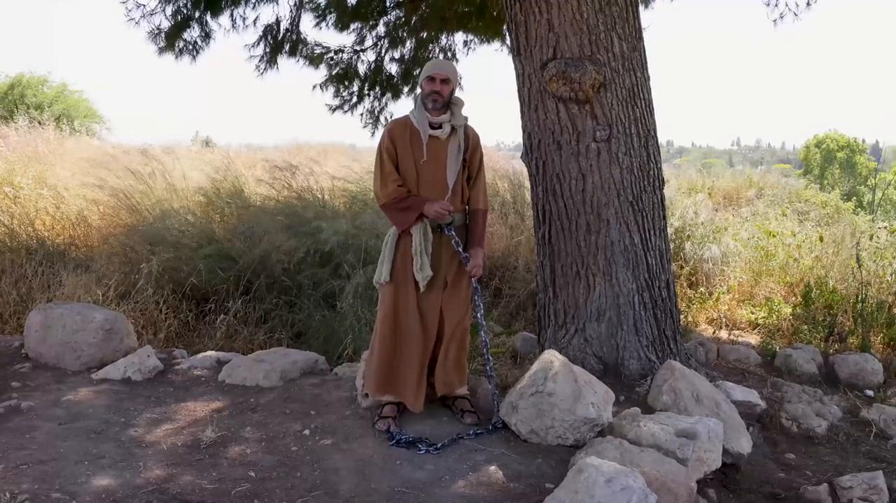

# Videos (Video Bible Dictionary)

**Video Bible Dictionary** © 2023 SRV Partners. Released under CC BY\-SA 4\.0 license. *Video Bible Dictionary* has been adapted in the following languages: Tok Pisin, عربي, Français, हिंदी, Bahasa Indonesia, Português, Русский, Español, Kiswahili, 简体中文 from *Video Bible Dictionary* © 2023 SRV Partners. Released under CC BY\-SA 4\.0 license by Mission Mutual

--------------------------------

## Cadenas (id: a26)

### Video Content

 (73 seconds)

[link](https://s3.amazonaws.com/cbbt-er.public/media/videos/a26/720p.mp4)

* **Associated Passages:** Marcos 5:1-20; Lucas 8:26-39

## Camello (id: a9)

### Video Content

 (58 seconds)

[link](https://s3.amazonaws.com/cbbt-er.public/media/videos/a9/720p.mp4)

* **Associated Passages:** Génesis 24:1-14; Génesis 24:15-28; Génesis 24:29-49; Génesis 32:1-21; Levítico 11:1-8; Jueces 6:1-10; Jueces 7:9-15; Jueces 8:4-21; 1 Samuel 15:1-9; 1 Samuel 27:1-28:2; 1 Reyes 9:26-10:13; 1 Crónicas 12:23-40; 1 Crónicas 27:25-31; 2 Crónicas 9:1-12; Esdras 2:64-70; Mateo 3:1-17; Mateo 19:13-30; Mateo 23:23-28; Marcos 10:13-31; Lucas 18:18-30

## Candelero (id: a21)

### Video Content

 (84 seconds)

[link](https://s3.amazonaws.com/cbbt-er.public/media/videos/a21/720p.mp4)

* **Associated Passages:** Mateo 5:13-16; Marcos 4:21-25; Lucas 8:16-18

## Casa en el tiempo de Jesús (id: a145)

### Video Content

 (87 seconds)

[link](https://s3.amazonaws.com/cbbt-er.public/media/videos/a145/720p.mp4)

* **Associated Passages:** 1 Samuel 9:15-27; Mateo 10:26-33; Mateo 24:15-28; Mateo 24:37-44; Marcos 2:1-12; Marcos 13:9-23; Lucas 5:17-26; Lucas 12:1-12; Hechos 9:36-43; Hechos 10:9-23

## Cesta como celemín (id: a30)

### Video Content

 (77 seconds)

[link](https://s3.amazonaws.com/cbbt-er.public/media/videos/a30/720p.mp4)

* **Associated Passages:** Mateo 5:13-16; Marcos 4:21-25

## Cesta grande (id: a27)

### Video Content

 (83 seconds)

[link](https://s3.amazonaws.com/cbbt-er.public/media/videos/a27/720p.mp4)

* **Associated Passages:** Mateo 15:29-39; Marcos 8:1-10; Marcos 8:11-21; Hechos 9:19-31

## Cesta para provisiones (id: a1253)

### Video Content

 (88 seconds)

[link](https://s3.amazonaws.com/cbbt-er.public/media/videos/a1253/720p.mp4)

* **Associated Passages:** Mateo 14:13-21; Mateo 15:29-39; Marcos 6:30-44; Marcos 8:11-21; Juan 6:1-15

## Cuatro suelos (id: a3)

### Video Content

 (89 seconds)

[link](https://s3.amazonaws.com/cbbt-er.public/media/videos/a3/720p.mp4)

* **Associated Passages:** Mateo 13:1-9; Mateo 13:18-23; Marcos 4:1-20; Lucas 8:4-15

