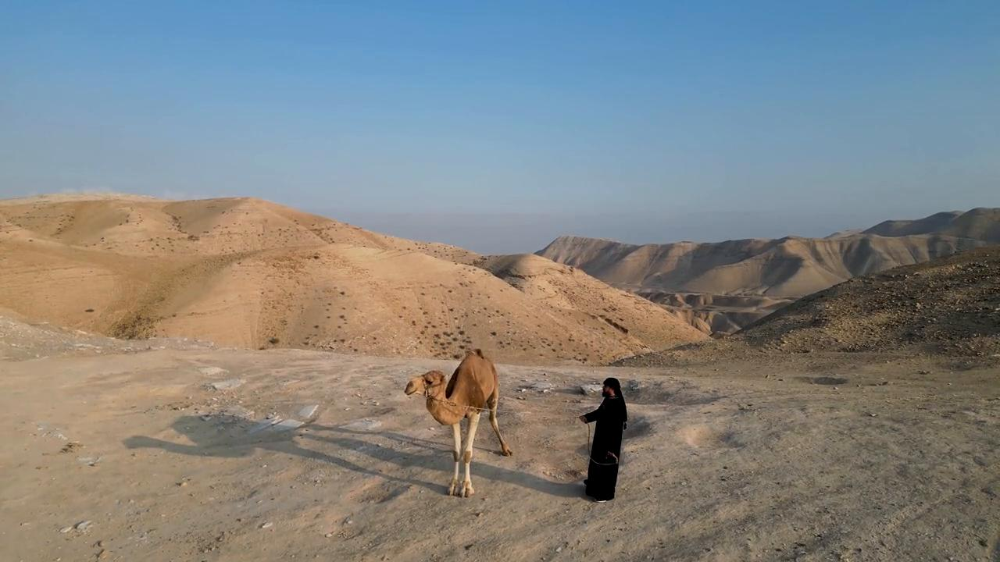

# Videos (Video Bible Dictionary)

**Video Bible Dictionary** © 2023 SRV Partners. Released under CC BY\-SA 4\.0 license. *Video Bible Dictionary* has been adapted in the following languages: Tok Pisin, عربي, Français, हिंदी, Bahasa Indonesia, Português, Русский, Español, Kiswahili, 简体中文 from *Video Bible Dictionary* © 2023 SRV Partners. Released under CC BY\-SA 4\.0 license by Mission Mutual

--------------------------------

## Desierto (id: a10)

### Video Content

 (55 seconds)

[link](https://s3.amazonaws.com/cbbt-er.public/media/videos/a10/720p.mp4)

* **Associated Passages:** Éxodo 3:1-10; Éxodo 3:11-22; Éxodo 17:1-7; Levítico 16:15-22; Números 14:26-38; Números 21:10-20; Números 34:1-15; Josué 15:13-19; Josué 15:48-63; Jueces 1:9-17; 1 Samuel 25:1-13; 1 Samuel 26:1-12; 2 Samuel 2:18-3:1; 2 Samuel 15:13-23; Mateo 3:1-17; Mateo 4:1-11; Mateo 24:15-28; Marcos 1:1-13; Marcos 8:1-10; Lucas 1:57-80; Lucas 3:1-14; Lucas 4:1-13; Lucas 5:12-16; Lucas 7:18-35; Juan 1:19-28; Hechos 7:35-43; Hechos 7:44-53; 1 Corintios 10:1-13

