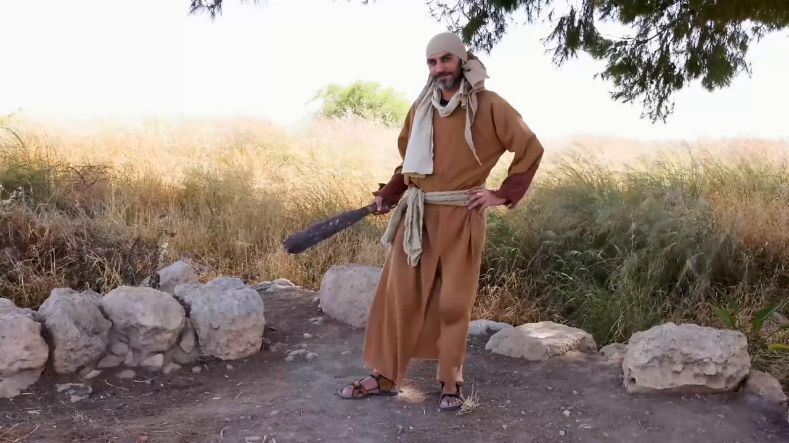

# Videos (Video Bible Dictionary)

**Video Bible Dictionary** © 2023 SRV Partners. Released under CC BY\-SA 4\.0 license. *Video Bible Dictionary* has been adapted in the following languages: Tok Pisin, عربي, Français, हिंदी, Bahasa Indonesia, Português, Русский, Español, Kiswahili, 简体中文 from *Video Bible Dictionary* © 2023 SRV Partners. Released under CC BY\-SA 4\.0 license by Mission Mutual

--------------------------------

## Gallo (id: a1388)

### Video Content

 (5 seconds)

[link](https://s3.amazonaws.com/cbbt-er.public/media/videos/a1388/720p.mp4)

* **Associated Passages:** Mateo 26:26-35; Mateo 26:69-75; Marcos 14:27-31; Marcos 14:66-72; Lucas 22:24-38; Lucas 22:47-62; Juan 13:31-38; Juan 18:15-27

## Garrote (id: a25)

### Video Content

 (74 seconds)

[link](https://s3.amazonaws.com/cbbt-er.public/media/videos/a25/720p.mp4)

* **Associated Passages:** Éxodo 21:18-27; Mateo 26:47-56; Marcos 14:43-52

