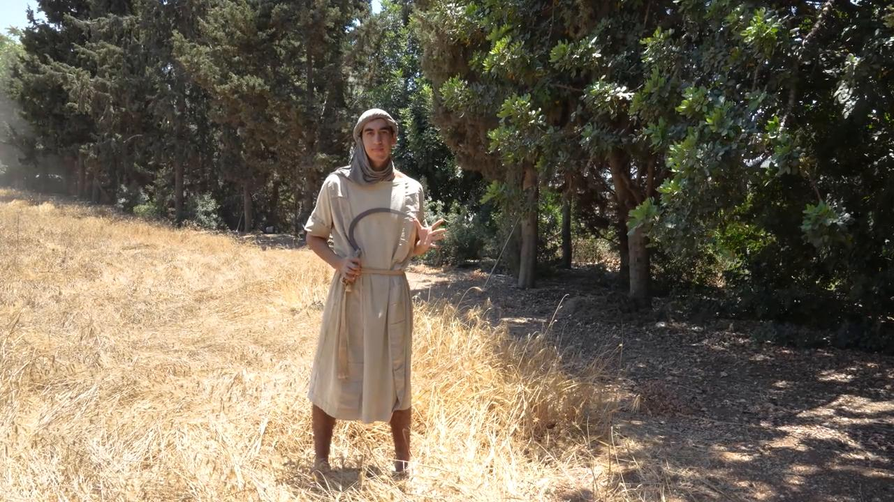

# Videos (Video Bible Dictionary)

**Video Bible Dictionary** © 2023 SRV Partners. Released under CC BY\-SA 4\.0 license. *Video Bible Dictionary* has been adapted in the following languages: Tok Pisin, عربي, Français, हिंदी, Bahasa Indonesia, Português, Русский, Español, Kiswahili, 简体中文 from *Video Bible Dictionary* © 2023 SRV Partners. Released under CC BY\-SA 4\.0 license by Mission Mutual

--------------------------------

## Hierbas amargas (id: a39)

### Video Content

 (71 seconds)

[link](https://s3.amazonaws.com/cbbt-er.public/media/videos/a39/720p.mp4)

* **Associated Passages:** Éxodo 12:1-13; Números 9:1-14; Mateo 26:17-25; Marcos 14:12-26

## Hoz (id: a185)

### Video Content

 (68 seconds)

[link](https://s3.amazonaws.com/cbbt-er.public/media/videos/a185/720p.mp4)

* **Associated Passages:** Deuteronomio 16:9-17; 1 Samuel 6:1-18; Marcos 4:26-34

