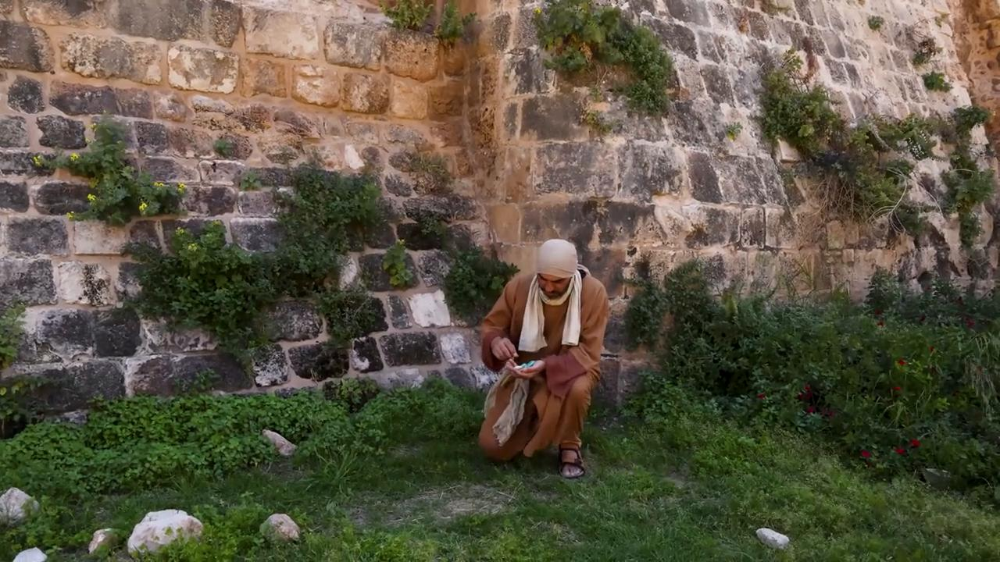

# Videos (Video Bible Dictionary)

**Video Bible Dictionary** © 2023 SRV Partners. Released under CC BY\-SA 4\.0 license. *Video Bible Dictionary* has been adapted in the following languages: Tok Pisin, عربي, Français, हिंदी, Bahasa Indonesia, Português, Русский, Español, Kiswahili, 简体中文 from *Video Bible Dictionary* © 2023 SRV Partners. Released under CC BY\-SA 4\.0 license by Mission Mutual

--------------------------------

## Sandalias (id: a184)

### Video Content

 (56 seconds)

[link](https://s3.amazonaws.com/cbbt-er.public/media/videos/a184/720p.mp4)

* **Associated Passages:** Génesis 14:17-24; Éxodo 3:1-10; Deuteronomio 25:1-10; Josué 5:10-15; 1 Reyes 2:1-12; Mateo 3:1-17; Marcos 1:1-13; Marcos 6:6-13; Lucas 3:15-22; Lucas 9:1-17; Lucas 15:11-32; Juan 1:19-28; Juan 13:1-11; Hechos 7:20-34; Hechos 12:6-19

## Serpiente (id: a168)

### Video Content

 (74 seconds)

[link](https://s3.amazonaws.com/cbbt-er.public/media/videos/a168/720p.mp4)

* **Associated Passages:** Génesis 3:1-24; Éxodo 4:1-17; Números 21:1-9; 1 Reyes 4:29-34; Mateo 7:1-12; Mateo 10:16-25; Mateo 12:33-37; Marcos 16:9-20; Lucas 3:1-14; Lucas 10:17-24; Lucas 11:1-13; Juan 3:9-21; 1 Corintios 10:1-13

## Sinagoga (id: a186)

### Video Content

 (88 seconds)

[link](https://s3.amazonaws.com/cbbt-er.public/media/videos/a186/720p.mp4)

* **Associated Passages:** Deuteronomio 17:14-20; Mateo 4:12-25; Mateo 6:1-8; Mateo 10:16-25; Mateo 12:1-14; Marcos 1:21-28; Marcos 2:23-3:6; Marcos 5:21-34; Marcos 6:1-6; Lucas 4:14-30; Lucas 4:31-44; Lucas 6:1-11; Lucas 7:1-10; Lucas 12:1-12; Lucas 13:10-17; Lucas 21:12-19; Juan 6:52-59; Juan 9:24-34; Hechos 13:13-22; Hechos 14:1-7; Hechos 17:1-9; Hechos 19:8-10

## Suertes (id: a18)

### Video Content

 (87 seconds)

[link](https://s3.amazonaws.com/cbbt-er.public/media/videos/a18/720p.mp4)

* **Associated Passages:** Números 33:50-56; Josué 14:1-15; Josué 18:1-10; 1 Samuel 10:17-27; 1 Crónicas 6:54-81; Mateo 27:32-44; Marcos 15:16-32; Hechos 1:15-26

