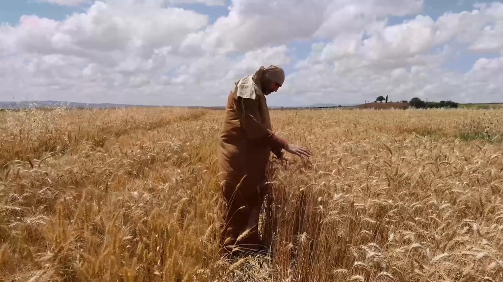
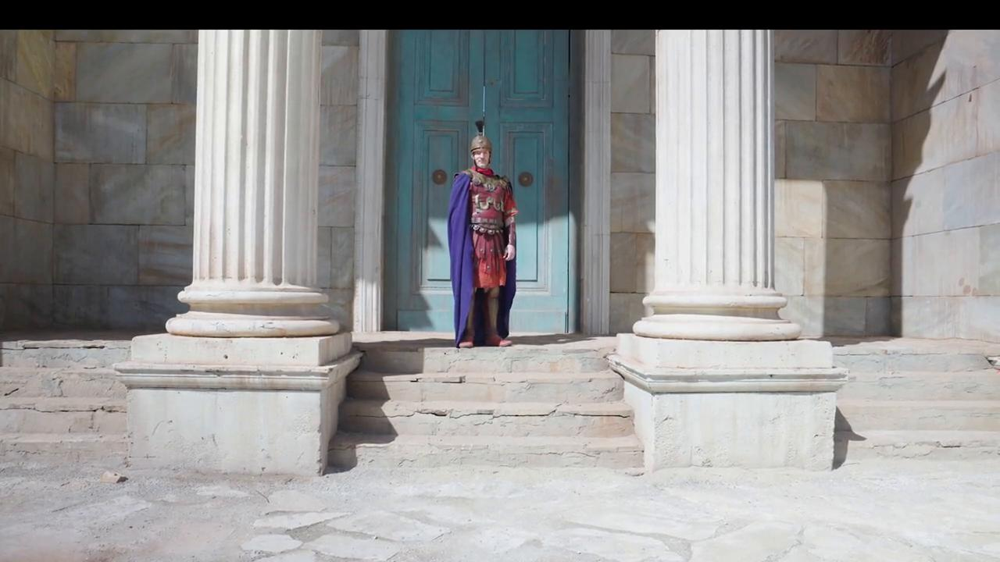

# Videos (Video Bible Dictionary)

**Video Bible Dictionary** © 2023 SRV Partners. Released under CC BY\-SA 4\.0 license. *Video Bible Dictionary* has been adapted in the following languages: Tok Pisin, عربي, Français, हिंदी, Bahasa Indonesia, Português, Русский, Español, Kiswahili, 简体中文 from *Video Bible Dictionary* © 2023 SRV Partners. Released under CC BY\-SA 4\.0 license by Mission Mutual

--------------------------------

## Torre de vigilancia para un viñedo (id: a36)

### Video Content

 (97 seconds)

[link](https://s3.amazonaws.com/cbbt-er.public/media/videos/a36/720p.mp4)

* **Associated Passages:** Génesis 35:21-29; 1 Crónicas 27:25-31; Mateo 21:33-46; Marcos 12:1-12; Lucas 14:25-35

## Trigo con espigas (id: a2)

### Video Content

 (131 seconds)

[link](https://s3.amazonaws.com/cbbt-er.public/media/videos/a2/720p.mp4)

* **Associated Passages:** Levítico 6:19-23; 1 Reyes 5:1-12; Mateo 12:1-14; Marcos 2:23-3:6; Lucas 6:1-11; 1 Corintios 15:35-41

## Trigo listo para la cosecha (id: a1)

### Video Content

 (79 seconds)

[link](https://s3.amazonaws.com/cbbt-er.public/media/videos/a1/720p.mp4)

* **Associated Passages:** Génesis 41:1-36; Éxodo 22:1-6; Levítico 6:19-23; Números 15:1-16; Números 20:1-13; Jueces 6:11-27; Jueces 15:1-8; 1 Samuel 12:1-17; 2 Samuel 4:1-12; 2 Samuel 17:15-29; 1 Reyes 5:1-12; 1 Crónicas 21:18-22:1; 2 Crónicas 27:1-9; Mateo 3:1-17; Mateo 13:18-23; Marcos 1:40-45; Marcos 4:1-20; Lucas 3:15-22; Lucas 8:4-15; Juan 12:20-36; 1 Corintios 15:35-41

## Tumba del jardín (id: a35)

### Video Content

 (84 seconds)

[link](https://s3.amazonaws.com/cbbt-er.public/media/videos/a35/720p.mp4)

* **Associated Passages:** Jueces 8:22-35; Marcos 15:40-47; Marcos 16:1-8

## Tumbas (id: a8)

### Video Content

 (93 seconds)

[link](https://s3.amazonaws.com/cbbt-er.public/media/videos/a8/720p.mp4)

* **Associated Passages:** Génesis 23:1-20; Jueces 8:22-35; Jueces 16:23-31; 2 Samuel 3:31-39; 1 Reyes 13:11-22; 2 Crónicas 21:11-20; Nehemías 2:1-10; Mateo 8:28-34; Mateo 23:23-28; Mateo 27:57-66; Mateo 28:1-15; Marcos 5:1-20; Marcos 6:14-29; Marcos 15:40-47; Lucas 8:26-39; Lucas 11:33-54; Lucas 23:50-56; Lucas 24:1-12; Juan 11:17-27; Juan 11:28-44; Juan 19:31-42; Juan 20:1-18; Hechos 5:1-11; Hechos 13:23-41

## Túnica (id: a4)

### Video Content

 (82 seconds)

[link](https://s3.amazonaws.com/cbbt-er.public/media/videos/a4/720p.mp4)

* **Associated Passages:** Jueces 14:10-20; 2 Samuel 15:24-37; Mateo 5:33-42; Marcos 6:6-13; Lucas 3:1-14; Lucas 6:27-36; Lucas 9:1-17; Juan 13:1-11; Juan 19:17-30; Hechos 9:36-43

## Túnica blanca (id: a131)

### Video Content

 (76 seconds)

[link](https://s3.amazonaws.com/cbbt-er.public/media/videos/a131/720p.mp4)

* **Associated Passages:** Marcos 16:1-8

## Túnica púrpura (id: a1356)

### Video Content

 (89 seconds)

[link](https://s3.amazonaws.com/cbbt-er.public/media/videos/a1356/720p.mp4)

* **Associated Passages:** Marcos 15:16-32; Lucas 16:19-31; Juan 19:1-16

