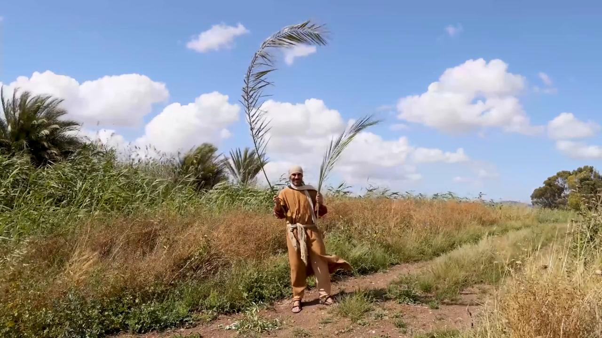

# Videos (Video Bible Dictionary)

**Video Bible Dictionary** © 2023 SRV Partners. Released under CC BY\-SA 4\.0 license. *Video Bible Dictionary* has been adapted in the following languages: Tok Pisin, عربي, Français, हिंदी, Bahasa Indonesia, Português, Русский, Español, Kiswahili, 简体中文 from *Video Bible Dictionary* © 2023 SRV Partners. Released under CC BY\-SA 4\.0 license by Mission Mutual

--------------------------------

## 橄榄山 (id: a40)

### Video Content

 (90 seconds)

[link](https://s3.amazonaws.com/cbbt-er.public/media/videos/a40/720p.mp4)

* **Associated Passages:** 撒母耳记下 16:1-4; 马太福音 21:1-11; 马太福音 24:3-14; 马太福音 24:29-36; 马太福音 24:37-44; 马太福音 24:45-51; 马太福音 26:26-35; 马可福音 11:1-11; 马可福音 13:1-8; 马可福音 13:24-31; 马可福音 13:32-37; 马可福音 14:12-26; 路加福音 19:28-44; 路加福音 22:39-46; 约翰福音 8:1-11; 使徒行传 1:12-14

## 橄榄树 (id: a44)

### Video Content

 (92 seconds)

[link](https://s3.amazonaws.com/cbbt-er.public/media/videos/a44/720p.mp4)

* **Associated Passages:** 创世记 8:1-19; 出埃及记 25:1-9; 出埃及记 30:22-33; 申命记 24:17-22; 士师记 9:7-21; 马可福音 11:1-11; 马可福音 13:1-8; 马可福音 14:32-42; 路加福音 19:28-44; 路加福音 22:39-46; 使徒行传 1:6-11; 使徒行传 1:12-14; 雅各书 3:1-12

## 橄榄树和棕榈树枝 (id: a5)

### Video Content

 (68 seconds)

[link](https://s3.amazonaws.com/cbbt-er.public/media/videos/a5/720p.mp4)

* **Associated Passages:** 马可福音 11:1-11; 约翰福音 12:12-19

