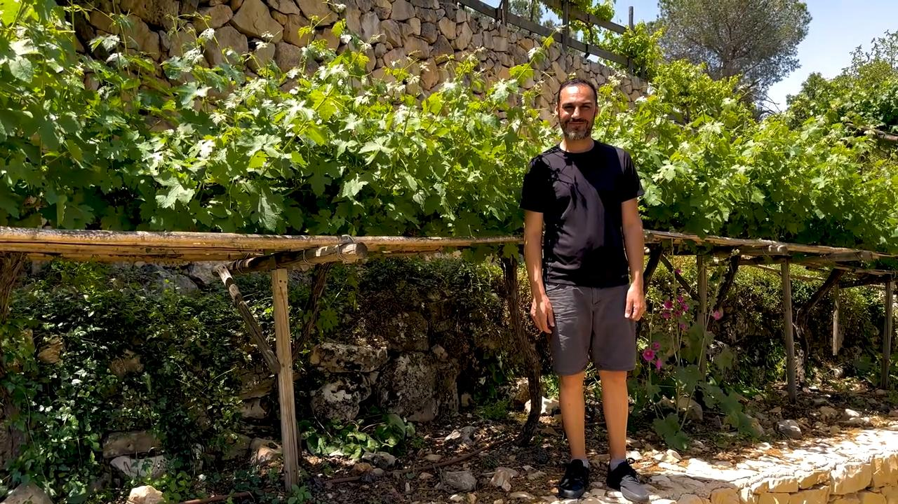

# Videos (Video Bible Dictionary)

**Video Bible Dictionary** © 2023 SRV Partners. Released under CC BY\-SA 4\.0 license. *Video Bible Dictionary* has been adapted in the following languages: Tok Pisin, عربي, Français, हिंदी, Bahasa Indonesia, Português, Русский, Español, Kiswahili, 简体中文 from *Video Bible Dictionary* © 2023 SRV Partners. Released under CC BY\-SA 4\.0 license by Mission Mutual

--------------------------------

## 葡萄园的守望台 (id: a36)

### Video Content

 (97 seconds)

[link](https://s3.amazonaws.com/cbbt-er.public/media/videos/a36/720p.mp4)

* **Associated Passages:** 创世记 35:21-29; 历代志上 27:25-31; 马太福音 21:33-46; 马可福音 12:1-12; 路加福音 14:25-35

## 葡萄园周围的石墙 (id: a34)

### Video Content

 (71 seconds)

[link](https://s3.amazonaws.com/cbbt-er.public/media/videos/a34/720p.mp4)

* **Associated Passages:** 马太福音 21:33-46; 马可福音 12:1-12

