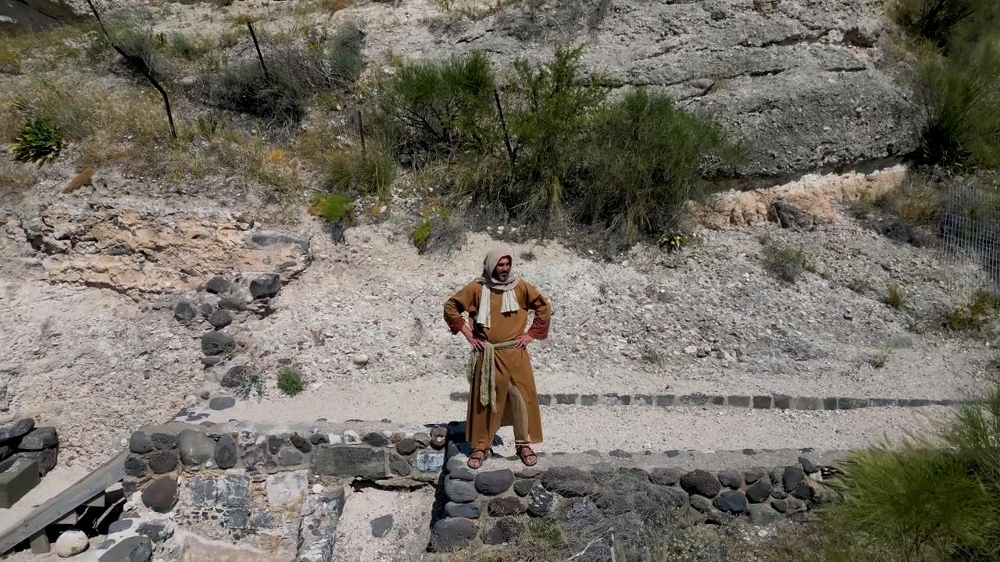

# Videos (Video Bible Dictionary)

**Video Bible Dictionary** © 2023 SRV Partners. Released under CC BY\-SA 4\.0 license. *Video Bible Dictionary* has been adapted in the following languages: Tok Pisin, عربي, Français, हिंदी, Bahasa Indonesia, Português, Русский, Español, Kiswahili, 简体中文 from *Video Bible Dictionary* © 2023 SRV Partners. Released under CC BY\-SA 4\.0 license by Mission Mutual

--------------------------------

## 悬崖 (id: a12)

### Video Content

 (49 seconds)

[link](https://s3.amazonaws.com/cbbt-er.public/media/videos/a12/720p.mp4)

* **Associated Passages:** 马太福音 8:28-34; 马可福音 5:1-20

