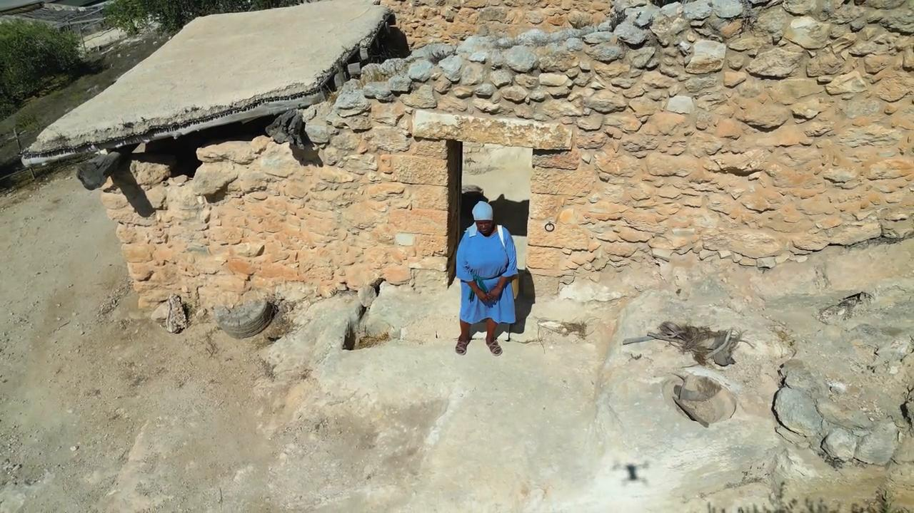

# Videos (Video Bible Dictionary)

**Video Bible Dictionary** © 2023 SRV Partners. Released under CC BY\-SA 4\.0 license. *Video Bible Dictionary* has been adapted in the following languages: Tok Pisin, عربي, Français, हिंदी, Bahasa Indonesia, Português, Русский, Español, Kiswahili, 简体中文 from *Video Bible Dictionary* © 2023 SRV Partners. Released under CC BY\-SA 4\.0 license by Mission Mutual

--------------------------------

## 耶稣时代的房屋 (id: a145)

### Video Content

 (87 seconds)

[link](https://s3.amazonaws.com/cbbt-er.public/media/videos/a145/720p.mp4)

* **Associated Passages:** 撒母耳记上 9:15-27; 马太福音 10:26-33; 马太福音 24:15-28; 马太福音 24:37-44; 马可福音 2:1-12; 马可福音 13:9-23; 路加福音 5:17-26; 路加福音 12:1-12; 使徒行传 9:36-43; 使徒行传 10:9-23

