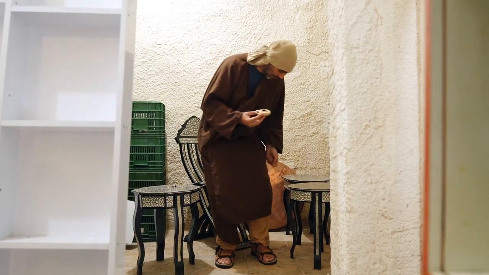

# Videos (Video Bible Dictionary)

**Video Bible Dictionary** © 2023 SRV Partners. Released under CC BY\-SA 4\.0 license. *Video Bible Dictionary* has been adapted in the following languages: Tok Pisin, عربي, Français, हिंदी, Bahasa Indonesia, Português, Русский, Español, Kiswahili, 简体中文 from *Video Bible Dictionary* © 2023 SRV Partners. Released under CC BY\-SA 4\.0 license by Mission Mutual

--------------------------------

## 犹太会堂 (id: a186)

### Video Content

 (88 seconds)

[link](https://s3.amazonaws.com/cbbt-er.public/media/videos/a186/720p.mp4)

* **Associated Passages:** 申命记 17:14-20; 马太福音 4:12-25; 马太福音 6:1-8; 马太福音 10:16-25; 马太福音 12:1-14; 马可福音 1:21-28; 马可福音 2:23-3:6; 马可福音 5:21-34; 马可福音 6:1-6; 路加福音 4:14-30; 路加福音 4:31-44; 路加福音 6:1-11; 路加福音 7:1-10; 路加福音 12:1-12; 路加福音 13:10-17; 路加福音 21:12-19; 约翰福音 6:52-59; 约翰福音 9:24-34; 使徒行传 13:13-22; 使徒行传 14:1-7; 使徒行传 17:1-9; 使徒行传 19:8-10

## 油灯 (id: a22)

### Video Content

 (75 seconds)

[link](https://s3.amazonaws.com/cbbt-er.public/media/videos/a22/720p.mp4)

* **Associated Passages:** 撒母耳记下 21:15-22; 撒母耳记下 22:21-29; 列王纪上 11:26-43; 列王纪上 15:1-8; 历代志下 21:1-10; 马太福音 5:13-16; 马太福音 6:19-34; 马太福音 12:15-21; 马太福音 25:1-13; 马可福音 4:21-25; 路加福音 8:16-18; 路加福音 11:33-54; 路加福音 12:35-48; 路加福音 15:1-10; 约翰福音 5:31-47; 约翰福音 18:1-14; 使徒行传 16:25-40; 使徒行传 20:7-12

