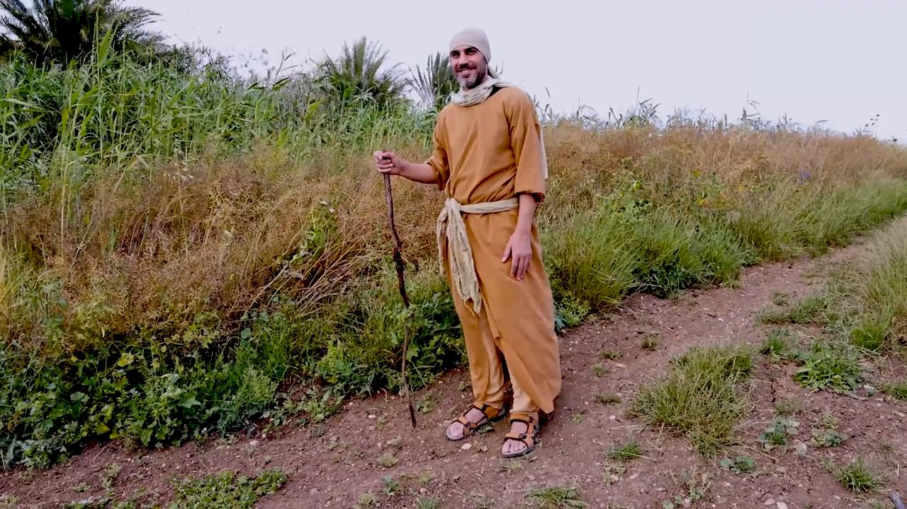

# Videos (Video Bible Dictionary)

**Video Bible Dictionary** © 2023 SRV Partners. Released under CC BY\-SA 4\.0 license. *Video Bible Dictionary* has been adapted in the following languages: Tok Pisin, عربي, Français, हिंदी, Bahasa Indonesia, Português, Русский, Español, Kiswahili, 简体中文 from *Video Bible Dictionary* © 2023 SRV Partners. Released under CC BY\-SA 4\.0 license by Mission Mutual

--------------------------------

## 长袍/里衣 (id: a4)

### Video Content

 (82 seconds)

[link](https://s3.amazonaws.com/cbbt-er.public/media/videos/a4/720p.mp4)

* **Associated Passages:** 士师记 14:10-20; 撒母耳记下 15:24-37; 以斯拉记 9:1-4; 以斯拉记 9:5-15; 马太福音 5:33-42; 马可福音 6:6-13; 路加福音 3:1-14; 路加福音 6:27-36; 路加福音 9:1-17; 约翰福音 13:1-11; 约翰福音 19:17-30; 使徒行传 9:36-43

